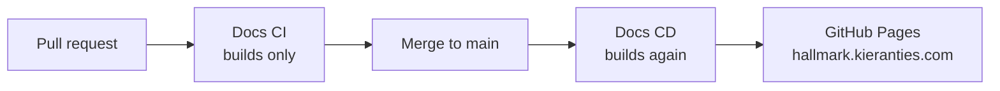

# The documentation site

**How the practice is published, and how to work on the site that carries it.** The site is a
Docusaurus build under `website/`, published to <https://hallmark.kieranties.com>.

## How the site is published

A pull request builds the site but never publishes it. A merge to `main` rebuilds from `main`
rather than reusing the pull request's output — the pull request was built from a test merge that
may never have existed on `main`.

## Where the practice serves from

Practice pages serve from `/docs/`, so a page is addressed as `/docs/loop/verified`. The root
path `/` carries the branded landing page and is not the docs root.

## A page is either finished or marked unwritten

A page that has not been written yet still has to exist, because `onBrokenLinks: 'throw'` and
`onBrokenAnchors: 'throw'` mean a page cannot link to one that is missing — and the practice's
pages link to each other in cycles. So an unwritten page is committed as a stub carrying its four
anchors, `sidebar_class_name: sidebar-unwritten`, and `<Unwritten />` under its title.

**A stub is listed, not hidden.** The sidebar is how a reader learns what the practice covers, and
a practice that shows one page of thirty-five reads as one page long. So every page is listed from
the start and an unwritten one says so — muted in the sidebar behind a hollow brass mark, and
carrying the notice on the page itself.

Writing a page is deleting the `<Unwritten />` tag and the `sidebar_class_name` line, and filling
in the four headings.

:::warning[`unlisted: true` is why this was missed once]
It was the first thing reached for, and it hides a page from the sidebar, the sitemap and search —
**but only in a production build.** `task start` shows unlisted pages, so the sidebar is full
locally and near-empty on the deployed site. Anything that changes what the sidebar carries has to
be checked against `task build`, never against the dev server alone.
:::

## Working on the site

The site runs entirely inside the repository's dev container; [Getting
started](getting-started.md) covers reaching that point.

| Command | Does |
| --- | --- |
| `task start` | Dev server with live reload |
| `task build` | Production build — the same build CI gates on |
| `npm run serve --prefix website` | Serve the production build |
