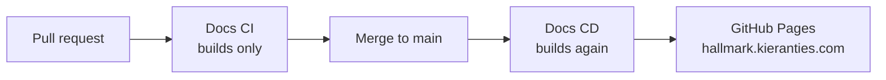

# The documentation site

**How the practice is published, and how to work on the site that carries it.** The site is a
Docusaurus build under `website/`, published to <https://hallmark.kieranties.com>.

## How the site is published

A pull request builds the site but never publishes it. A merge to `main` rebuilds from `main`
rather than reusing the pull request's output — the pull request was built from a test merge that
may never have existed on `main`.

## Where the practice serves from

The practice is the whole site, so it serves from the root: `docs.routeBasePath` is `/`, and a
page is addressed as `/process/sift`. `website/docs/index.mdx` is the landing page, not a
separate React page beside it.

## A page is either finished or hidden

A page that has not been written yet still has to exist, because `onBrokenLinks: 'throw'` and
`onBrokenAnchors: 'throw'` mean a page cannot link to one that is missing — and the practice's
pages link to each other in cycles. So an unwritten page is committed as a stub carrying
`unlisted: true`, which keeps it built and linkable while hiding it from the sidebar, from
search and from the sitemap.

**Deleting that one line is what publishes a page.** A page is either finished and visible, or a
stub nobody can land on.

## Where the brand comes from

`website/src/css/hallmark/` is copied verbatim from `.claude/skills/hallmark-design` and is not
hand-edited — change the design system and re-copy. `website/src/css/hallmark/README.md` states
the copy command and what deliberately sits outside that directory.

Two things are not part of the design system and do live in the site: `src/css/site.css` (the
navbar GitHub glyph, and dark-mode parity for mermaid, which Docusaurus cannot theme per colour
mode) and `src/components/Glossary.tsx` (the terminology filter).

## Working on the site

The site runs entirely inside the repository's dev container; [Getting
started](getting-started.md) covers reaching that point.

| Command | Does |
| --- | --- |
| `task start` | Dev server with live reload |
| `task build` | Production build — the same build CI gates on |
| `npm run serve --prefix website` | Serve the production build |
