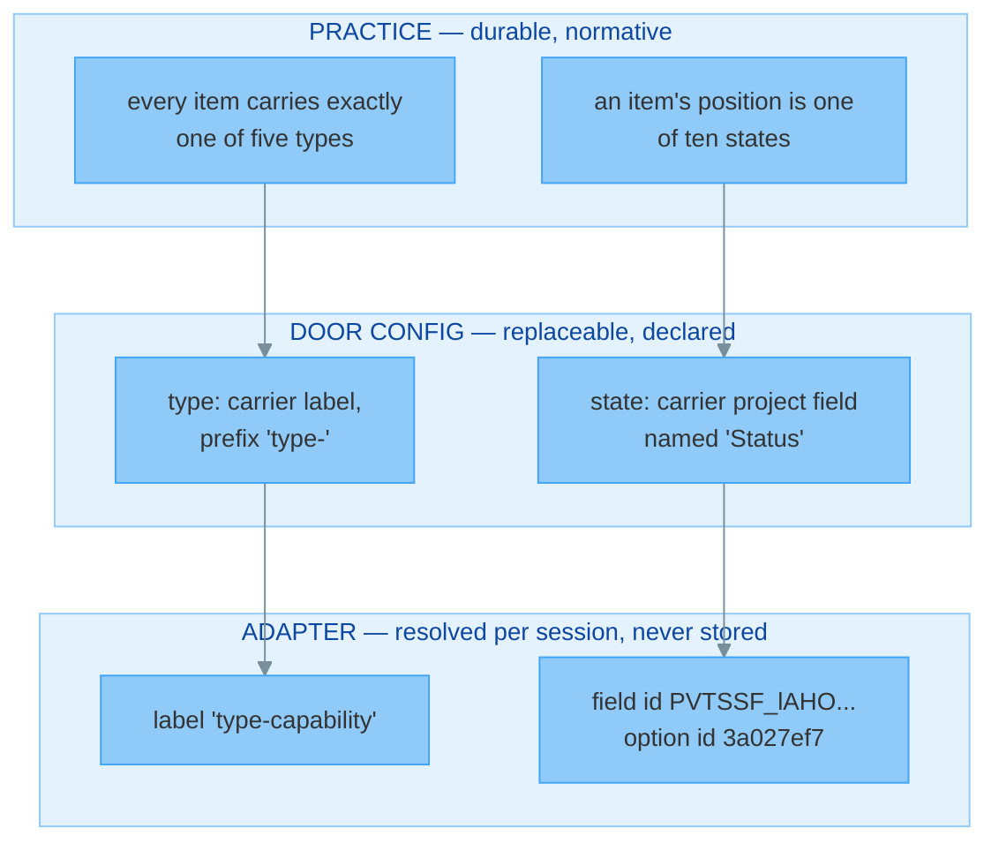
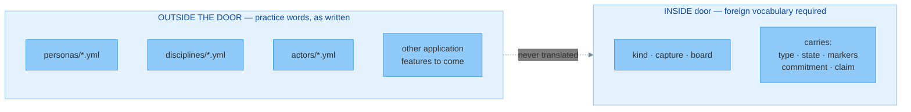

# The door as declared mapping — 2026-08-13

**Vision.** The `door` section of `.hallmark/repository.yml` declares how this
application carries the practice's vocabulary. It records **decisions**, never
derived facts, and it is **parameterised by `door.kind`** — because the kind
determines which carriers exist at all.

Emerged while sifting **#27** (the capture skill), from the question of whether a
skill should re-read and re-interpret the door's configuration on every act.

---

## What the door does not record today

`.hallmark/repository.yml` currently carries three keys:

```yaml
door:
  kind: github-issues
  capture: https://github.com/Kieranties/hallmark/issues
  board: https://github.com/users/Kieranties/projects/2
```

Everything else about how this repository carries the practice lives as **prose
inside two skills**. That is **F12** — *"the door's own configuration is declared
nowhere, versioned nowhere, checked by nothing. The most load-bearing piece of the
instantiation is the one piece with no record"* — and this is that finding
enumerated:

| Practice concept | Carried here by | Recorded today in |
|---|---|---|
| item | an issue | assumed |
| item type (5 values) | label `type-*` | skill prose · concession `6.1` |
| state (10 values) | project field `Status` | skill prose · concession `6.2` |
| marker — act needed (3) | labels `needs-*` | skill prose |
| marker — who is invited (2) | labels `ready`, `ready-for-agent` | skill prose |
| commitment + version | milestone | **nothing** → #9 |
| claim | assignee | skill prose → #46 |
| concession record | comment · `<issue>.<n>` · `concession` label | skill prose |
| parent / child | sub-issues | assumed |
| verdict countability | an HTML comment marker | skill prose → #33 |

Eight of the ten live only in prose. Two are not written down anywhere.

---

## The reframing

The objection raised against declaring this was the repository's sharpest rule —
***if it is queryable, do not write it down***, which has already caught six things
including a cached issue title (#16). Labels and fields **are** queryable from
GitHub, so declaring them looks like the same defect.

**It is not, and the reason generalises.**

> The door section does not record **what the labels are**. It records **the
> decision about how the practice's vocabulary is carried here**.

A decision is not derived from anything. It is the one class of fact that *must* be
written down. `type-capability` being a label rather than a field is not an
observation copied from the platform — it is a choice someone made, and today that
choice survives only as prose in two skills and half of a concession.

**The test that separates them:**

> **Declare the decision. Query the handle.**
> *Would someone else, instantiating this same practice on this same platform, have
> had to make this choice? Then it is a decision.*

`Status` carrying the state axis is a decision. `PVTSSF_lAHOAAVcv84BgJ4_zhaXnp0`
is a handle GitHub assigned — volatile, and rediscovered by query in every session
so far.

---

## Three layers

### Where a practice concept becomes a platform value



| Colour | Meaning |
|---|---|
| Purple | The practice — says nothing about carriers |
| Blue | The door configuration — decisions, stable terms |
| Grey | The adapter — platform handles, resolved and discarded |

**The middle layer never holds a handle, so it cannot rot. The bottom layer holds
nothing durable at all.**

This layering is itself an application detail, and deliberately so: *in GitHub you
have volatile node ids; in Jira you may not*. The practice cannot say **query the
handle**, because whether handles exist is a property of the platform. The practice
says only *declare the decisions*; how those resolve is the adapter's problem.

---

## The boundary rule

The most valuable thing to come out of the session, because it is an invariant
rather than a layout:

> **The door is the only place the practice's vocabulary meets a foreign one.**
> Inside it, mapping. Everywhere else in `.hallmark/`, the practice's own words, as
> written.

### What sits inside the door, and what does not



| Colour | Meaning |
|---|---|
| Blue | Declarations using the practice's own vocabulary |
| Grey | Application features not yet designed |
| Orange | The door — where a foreign vocabulary is expected |

**This gives the controlled-vocabulary lint a scope it has never had.** The model
names *a lint against the controlled vocabulary* as one of three guards and never
says what it ranges over. It ranges over everything **except** `door.carries`,
where foreign words are not merely tolerated but **required** — a mapping that
renames the foreign thing fails to refer.

---

## Why the mapping sits inside `door`

Three shapes were weighed.

| | Shape | Verdict |
|---|---|---|
| **A** | `door.carries` — the mapping nested inside the door | **Chosen** |
| **B** | `commitment:`, `claim:` as siblings of `door:` | Rejected. This is #9's assumed shape |
| **C** | `application:` as the roof, with `door` inside it | Rejected |

**The decisive argument is that the available carriers are a function of `kind`.**
`github-issues` has milestones and sub-issues; another tracker has neither and has
something else instead. The mapping is not merely *related* to the door — it is
**parameterised by** it, and a sibling key would be a set of options floating free
of the thing that determines which options exist.

**Consequence for #4:** `door.carries` is a **discriminated union keyed on `kind`**,
not a flat schema.

**`door` does not thereby become the whole application mapping.** Personas,
disciplines and actors sit outside it, correctly, and further application features
are expected to. The door is bounded by what it is: *where items live, and how the
practice's axes are carried on them*.

---

## Two expression forms

The carrier determines how the mapping can be written, and both forms are needed.

```
github-issues                          jira
─────────────                          ────
type:                                  type:
  carrier: label                         carrier: issue-type
  prefix: "type-"                        map:
                                           capability:  Story
  ← GENERATIVE                             initiative:  Epic
    carrier + practice name                fix:         Bug
    derives the value                      chore:       Task
                                           question:    Question

                                         ← EXPLICIT
                                           every practice value names
                                           its foreign counterpart
```

**The generative form is a convenience for free-text carriers only.** A label is
free text that this repository chose to shape after the practice's own names. Any
carrier with a *fixed foreign vocabulary* — Jira issue types, a workflow's statuses
— must be explicit per value.

GitHub will need the explicit form too the moment `6.1` clears: Issue Types are an
org-level feature, and if this repository ever gets them, `capability → <whatever
the org named it>` stops being derivable from a prefix.

---

## What this subsumes

| | How it is affected |
|---|---|
| **#9** | *"How commitment and version are tracked must be declarable, not fixed"* — **this idea, discovered one axis at a time.** #9 says it almost verbatim: *"That is an application concern, exactly like the door — and like the door, it needs to be declared rather than assumed."* Two independent derivations of one rule |
| **F12** | The finding this closes. The door's configuration gains a record |
| **`6.1`** | **Narrowed.** It bundles *type is carried by a label* with *nothing enforces exactly one*. The first stops being a compromise once it is a declared mapping — the practice demanded that every item carry exactly one of five types, never that a field carry it. Only the enforcement half is real debt |
| **`6.2`** | **Possibly mis-scoped rather than conceded.** Its standard is *"reserved terms are used as written; a bare `Status` is the ambiguity the retirement of `Done` exists to prevent"* — but `Status` appears inside the door, naming GitHub's field. Under the boundary rule that is not a breach; calling it `State` in the mapping would be. **Worth testing properly before acting on it** |
| **#33** | The verdict marker is a door fact and would be declared rather than encoded in skill prose |
| **#46** · **#17** | The claim mechanism becomes declared — `claim: assignee`. That makes the inadequacy a property of **this application**, not of the practice. The practice's claim requirement is sound; this carrier is weak |
| **#37** · **#38** | The other half of the cost model. #38 persists the **practice** side as data; this persists the **application** side. A skill reading both needs no prose at all |
| **#27** | Specifies against a door it **reads**, rather than inventing the thing it reads |

---

## Decisions taken

1. **The mapping lives at `door.carries`**, inside the door, parameterised by `kind`.
2. **The door records decisions, never handles.** *Declare the decision, query the
   handle.*
3. **The boundary rule**: foreign vocabulary inside the door, practice vocabulary
   everywhere else.
4. **Both expression forms are supported** — generative for free-text carriers,
   explicit for fixed foreign vocabularies.
5. **This is its own item, not part of #27.** It serves `work`, `verification` and
   #4's checker as much as `capture`, and is parameterised by `kind` rather than by
   any one skill's needs.

---

## Constraints

Definitively true, not open questions.

- **`door.carries` is a discriminated union on `kind`.** A flat schema cannot express
  that milestones exist for one kind and not another.
- **The configuration must never hold a platform handle.** Field ids, option ids and
  node ids are resolved per session and discarded.
- **Nothing checks this until #4 exists.** A declared mapping that drifts from the
  live door is undetectable until there is a checker, so the declaration's value is
  *making drift detectable*, not preventing it.
- **The practice cannot mandate the declare/query split.** Whether volatile handles
  exist at all is a platform property.

---

## Deferred and open

- **Concessions are deferred entirely.** Their design is later work. Noted only that
  the *placement* half — a comment on the item, the `concession` label — is a door
  fact whatever is decided about the record's shape and numbering.
- **Whether `carries` holds one shape or three.** Value-set mappings (type, state),
  mechanism declarations (claim, commitment) and record placement (verdicts,
  concessions) may not be the same kind of thing. Raised, not resolved.
- **`state` was not tested across two trackers.** It is the hardest case — ten values
  plus off-ramps, against a tracker whose statuses are fixed and whose transitions
  may be gated by a workflow.
- **What happens when a `kind` cannot carry something at all.** GitHub cannot enforce
  *exactly one* type label (`6.1`). Whether the door can declare a gap — and thereby
  make a concession's existence computable rather than remembered — is unexplored.
- **An ADR is owed and is not written here.** This meets the judgement-ceiling trigger:
  real alternatives were weighed (A/B/C above) and reversal is expensive once #4's
  schema and three skills sit on it. This repository discharges ADRs at `Planned` on
  the item that implements the decision, and writing one now would put a decision
  record outside the door.
