# Hallmark - Diagrams

**The structural diagrams of the model, regenerated from the settled design.** Terms are reserved — see [[Hallmark - Glossary]]. The reasoning is in [[Hallmark - Decisions]].

> [!IMPORTANT] What is here, and the one diagram deliberately missing
> These eight are drawn from parts of the model that are **structurally stable** and are not expected to move during pass one.
>
> **There is no end-to-end process flow** — *local machine through to client environment*, which is what the brief actually asked for. It would have holes at exactly the operational end: **operations, security and compliance are empty**, support workflow has structure but no mechanics, and **state transitions are not designed at all** (tier B), so every arrow between states would be unlabelled.
>
> **We have a precedent for building it anyway.** *Hallmark - Ideal flow* was that diagram. It was ruled non-authoritative (D103), went stale, and was **deleted in round 12 rather than left as a trap.** Do not rebuild it until tier A and tier B are done. Per D128, diagrams are **regenerated from the settled model** — never patched.

---

## 1 · Parties, actors, roles

Two symmetric branches converge on the actor. **A persona is a party the running *system* serves; a discipline is a party that acts on the *change*** — distinguished by their object, not by a verb.

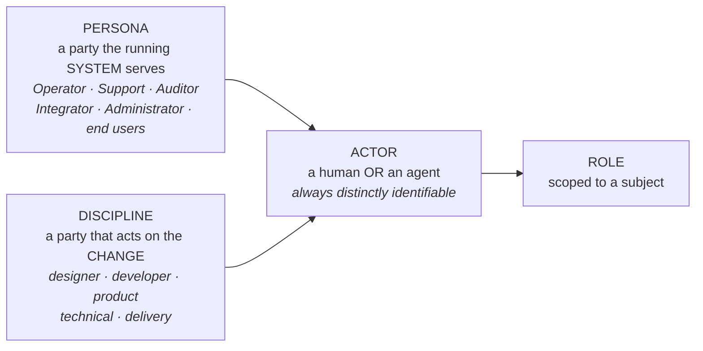

**Any role may be held by either kind of actor, including Decider.** Accountability is *derivative*: consequence lands on the human who **delegated** that checkpoint. Chain length is zero when a human acts directly.

### The four roles

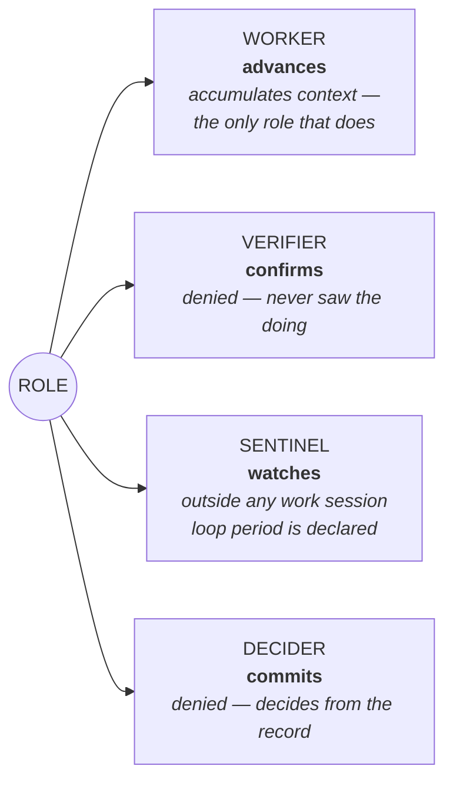

### What a role carries

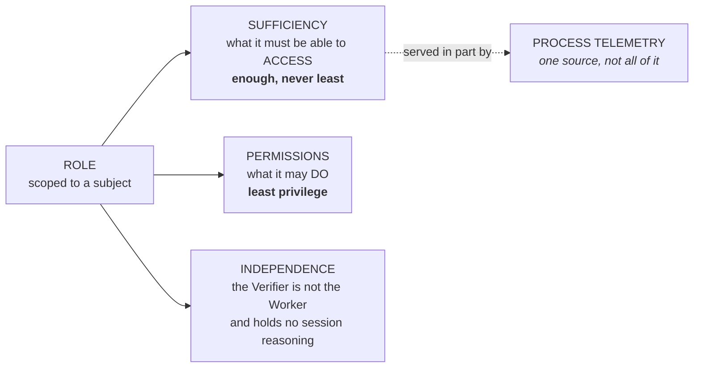

> **This is a sufficiency model, not an access-control model.** It asks *"can this actor see what it needs?"* — never *"is it prevented from seeing too much?"* All three sit on the **role**, not the actor, because delegation grants a role: were sufficiency carried by the actor, delegating would grant permissions without access and *"nothing is undelegable"* would be false in practice.

---

## 2 · The circuit

**The state track is a circuit between two persona moments**, with a blurred zone at each end. Capture is not *acting on the change* — it is the entry before the item exists. Delivery is the exit, after the work is published and before anyone uses it.

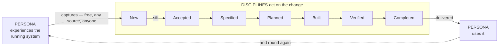

This is why the one door is where it is, why capture is free, and why two-done reporting exists: **the exit is blurred**, so *published* and *in their hands* must be reported separately.

A persona raising a runtime bug report does **not** thereby become a discipline. The test is **holding a role in the flow** versus **supplying a signal to it**.

---

## 3 · The state track and rollout coverage

Two scales, deliberately not drawn as one line. Drawing rollout as states is what made a team report *"Released"* meaning *we shipped it* while a client heard *I have it*.

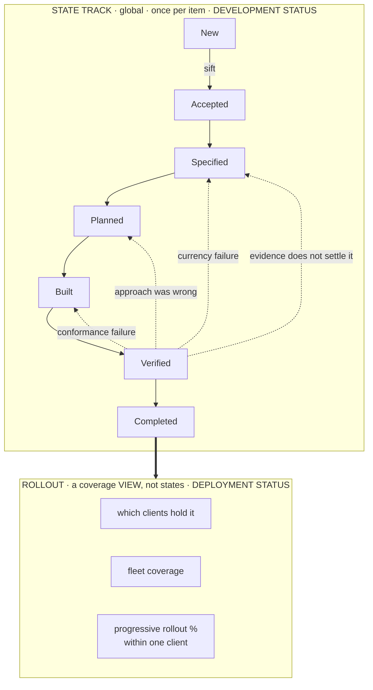

**A state is achieved when its criterion is met**, and an item's position is the highest state it has reached. **States are achievements, not queues you wait in.**

**The state says where an item is and what is next — never when, or by whom.** Finding work is a separate signal: a **marker** on the item calling it to action. Its form belongs to the application.

**Rollout is non-monotonic by design** — a rollback lowers coverage. That is a fact to record, not an anomaly.

`Completed` means *the artifacts are published for consumption, and the catalogue is proven to contain them* — queried and found, never reported. **"GA" is a defined gloss and never the primary name**; the closer industry analogue is RTM.

**Publishing may run ahead of verification and does not advance the state** — publishing is an act, `Completed` is a state.

### The stages within rollout

Named for **the act that completes there**, never for a box. How many environments exist is an application concern — a small team may have exactly one.

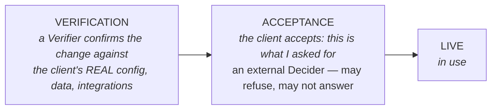

> **The invariant: live use *actions* a verified and accepted change — it never *discovers* one.**

---

## 4 · Commitment, and where stopping is derived

**Commitment is an axis, not a lifecycle.** Two values, moving independently of state.

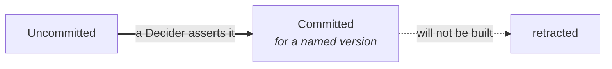

**Independent of state.** An item can be `Built` and `Uncommitted` — a spike nobody promised. An item can be `Committed` for `v1.4` and still sitting at `New`.

**`Explored` and `Scheduled` are retired.** `Explored` duplicated the state track's `Specified`; `Scheduled` duplicated `Committed`, which already names a version.

### Stopping is derived, never chosen

The word falls out of the two axes read together — *the cost of stopping is a function of how far it travelled*, finally mechanised.

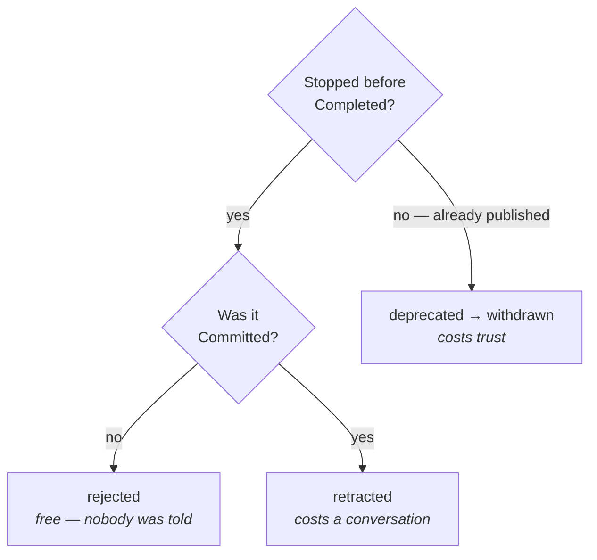

**`Duplicate` is orthogonal** — *this is the same as that*, at any point, regardless of commitment.

**The assertion/evidence boundary sits at `Completed`.** Before it, no evidence can exist and claims are **asserted** by an accountable Decider at a stated confidence tier. After it, claims are **derived** from passing specs and **no actor may assert them**, of either kind.

> **`Deprecated` and `withdrawn` are deferred and unresolved.** The hard part: **removal happens at a finer grain than a claim does.** Dropping CSV export while keeping PDF is neither a withdrawal nor a deprecation of *"a client can export invoices"* — it is a **revision of the claim**, and the model has no way yet to say *"the revision removed something someone relied on"*.

`delivered` is **per client** and is a coverage fact, not a value on either axis.

---

## 5 · The truth spine

Built to kill the anchor failure: *a client is sold a feature that was remembered wrong.*

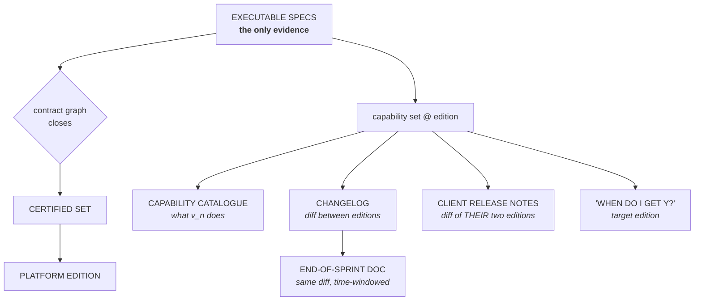

**One evidence base, many renderings.** They cannot contradict each other, and nobody maintains four documents.

**Capability is claimable only if a passing executable spec proves it.** A hand-authored catalogue is *remembered wrong* with better formatting and a longer half-life.

---

## 6 · Fractal editions and the compound version

The platform certifies its own closure. Each product certifies **against a named platform edition**. A client's customisation does the same. **Closure holds at every level rather than at one.**

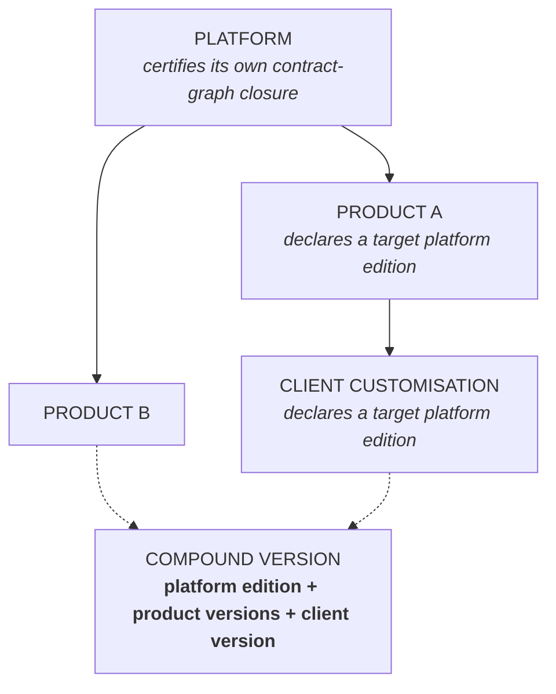

> **The platform edition is the compatibility key.** Without it, *"can product A v3 ship with product B v7?"* is a pairwise question — N² across the product set. With it, one check on one value.

**Target is a floor, not a pin or a range.** A product declares *"requires edition E or later"*; a deployment resolves to `max(floors)`. Backward compatibility is **proven by contract-graph closure, not promised by a team**. Irreconcilable floors are a **concession**, not a new control.

**Client-facing identity stays the product version.** The platform edition is *derived* from it.

---

## 7 · Documentation layering

**Knowledge is a versioned dependency, not a wiki.** The failure it prevents is a document describing a version that no longer exists — the anchor failure in prose form.

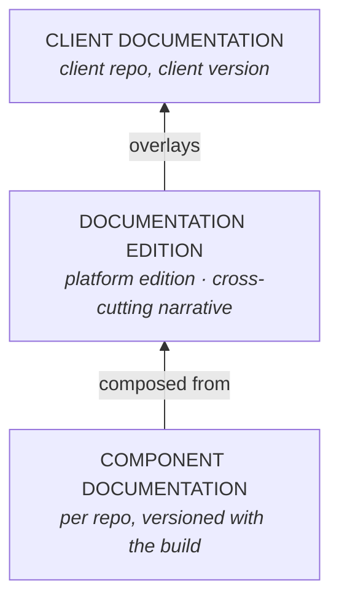

Of a documentation edition's four parts, **three are generated and one is authored**:

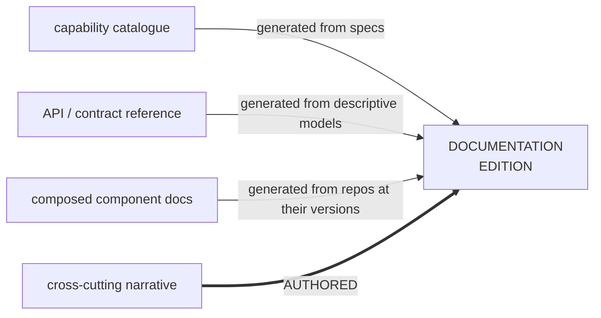

Client documentation may **add or constrain, never contradict** — a contradiction is a defect, and the generated portions are machine-checkable for it.

**Documentation visibility is distinct from code visibility**: a client may read what they may not see. The composed surface carries an audience classification.

---

## 8 · Certification environment

Provisioned **on request, never always-on**. A shared, mutable, user-accessible environment destroys the determinism verification depends on.

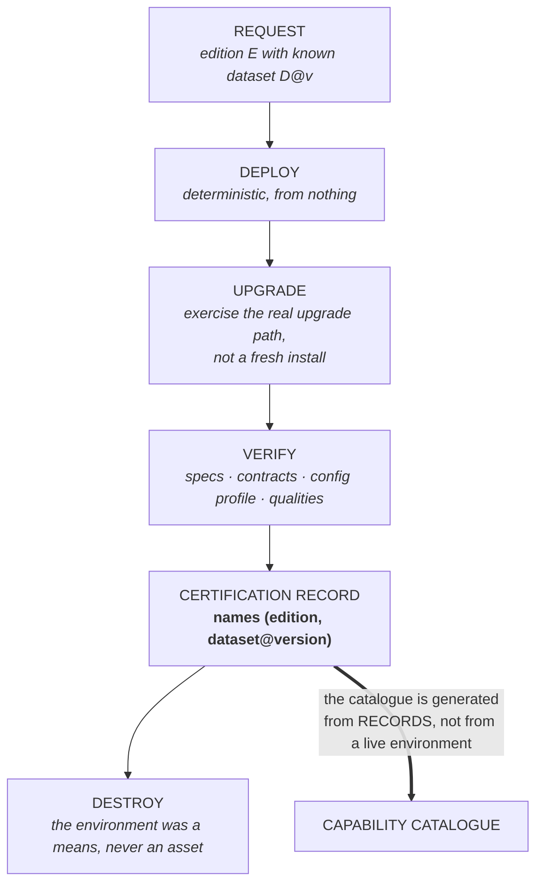

**On-request provisioning also serves PoCs and demos** — a demo running on a provisioned certified edition **is** the product, which closes another route to the anchor failure. It makes cost attributable too: who provisioned what, and why.

---

## Regenerating these

Per **D128**, diagrams are **regenerated from the settled model, never patched.** If a decision moves, redraw the affected diagram from the current glossary and delivery model rather than editing the picture — a patched diagram is how a superseded state name survives for three rounds.

**Not yet drawable, and why:**

| | Blocked on |
|---|---|
| **End-to-end process flow** | Operations · security · support mechanics — all empty. Plus tier B |
| **State transitions** | Tier B. States are defined by what must be *true*; nothing yet says what makes work **move** |
| **Operations · incident flow** | Nothing designed |
| **Security and compliance** | Nothing designed |
| **The application** | Sixteen artifacts, no storage, retrieval or lifecycle for any of them |

## Mentions

![[mentions.base]]
