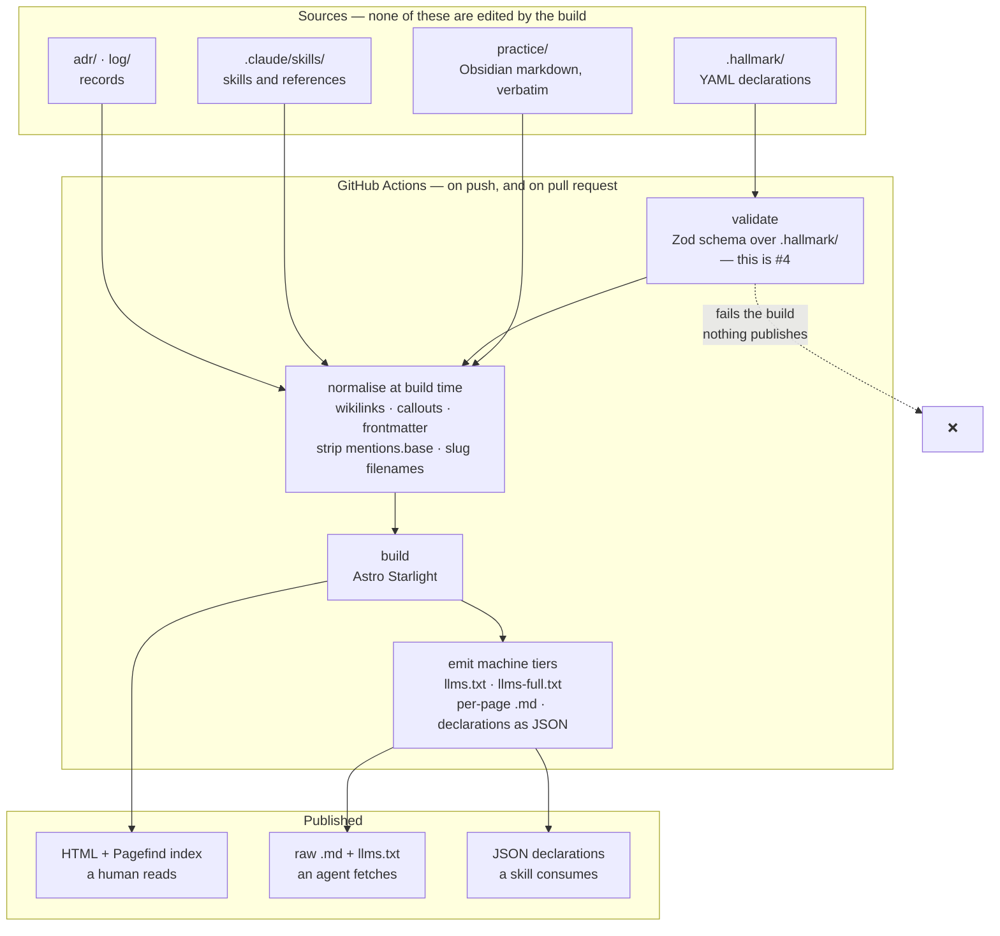
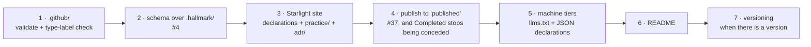

# Research — a docs site for Hallmark

| | |
|---|---|
| **Date** | 2026-08-17 |
| **Status** | Research. **No decision is taken here** |
| **Branch** | `claude/agent-docs-site-research-b97dit`, from `dogfood` |
| **Relates to** | [#37](https://github.com/Kieranties/hallmark/issues/37) (build pipeline), [#38](https://github.com/Kieranties/hallmark/issues/38) (practice out of Obsidian), [#30](https://github.com/Kieranties/hallmark/issues/30) (findings with nowhere to go), [#15](https://github.com/Kieranties/hallmark/issues/15) (landed version uncarried) |

> **On placement.** This file sits at `research/` because it uses foreign vocabulary
> — *plugin*, *build*, *branch* — which the boundary rule in
> [ADR 0001](../adr/0001-the-door-declares-how-it-carries-the-practice.md) confines out of
> `.hallmark/`. That placement is undeclared and free to reverse, and it repeats the
> gap [#52](https://github.com/Kieranties/hallmark/issues/52) already names.

---

## 1 · The requirements

Seven were stated. Two more fall out of the corpus survey in §2, and they are marked
**derived** because nobody asked for them.

| # | Requirement | Reading used here |
|---|---|---|
| **R1** | A README | The repository root has none today. `practice/README.md` is a provenance note for one directory, not the repository's front door |
| **R2** | A build pipeline | Something runs on a commit. #37: *"`main` has no `.github/` directory"* |
| **R3** | Published to a docs branch or hosting | The artifact leaves the repository and is retrievable |
| **R4** | Readable by a human, and by an agent as markdown | Rendered HTML for people; raw markdown plus an index for machines |
| **R5** | Mermaid diagrams | 13 of them exist already |
| **R6** | Search | Over the whole corpus |
| **R7** | Versioning of content | More than one version of the practice readable at once |
| **R8** | *(derived)* Generated from the declarations, not hand-copied | `.hallmark/` is structured data, and a site that restates it by hand creates a second source of truth |
| **R9** | *(derived)* Non-destructive to `practice/` | Explained in §3. This one eliminates more options than any other |

---

## 2 · What the site has to publish

Measured on `dogfood`, not estimated.

| Body | Files | Size | Shape |
|---|---|---|---|
| `practice/` | 10 | **~600 KB** | Obsidian markdown. The practice itself |
| `.claude/skills/` | 12 | ~57 KB | Two skills and their state references |
| `.hallmark/` | 12 | ~8 KB | YAML declarations — door, personas, disciplines, actors |
| `log/` | 2 | ~43 KB | Session logs, including the 26 findings of #30 |
| `adr/` | 1 | ~5 KB | ADR 0001 |

**The corpus is heavily skewed.** Two files carry most of it:

- `Hallmark - Decisions.md` — **426 KB**, 186 decision rows in one table plus the record beneath.
- `Hallmark - Glossary.md` — **85 KB**, 864 lines, and **102 of the corpus's 139 wikilinks**.

Both are single-page hubs, and both punish a generator that is slow or that wants content
split into small pages.

### What the markdown actually contains

| Feature | Count | Consequence |
|---|---|---|
| **Wikilinks** | 139, of which ~130 are **intra-page anchors** — `[[#Commitment\|committed]]` | Mechanically convertible to `[committed](#commitment)`. This is the good news; the Glossary does not need a link graph, it needs anchor rewriting |
| **Mermaid** | 13 blocks, all `flowchart` (LR, TB, BT) | R5 is satisfied by every candidate. It is not a discriminator |
| **Obsidian callouts** | 12 — `[!WARNING]`, `[!NOTE]`, `[!IMPORTANT]` | Must map to the generator's admonition syntax |
| **`![[…]]` embeds** | In **all 10** practice files — the `mentions.base` footer | Obsidian-only. Must be stripped, and will render as literal junk if it is not |
| **Frontmatter** | 9 files carry `type`/`status`/`projects`/`people`/`tags`/`created` | Obsidian vault keys, not site keys. `projects: "[[Hallmark]]"` is a wikilink inside YAML |
| **Filenames** | `Hallmark - Delivery model.md` — spaces and a ` - ` separator | Need slugging to `delivery-model` |

---

## 3 · The constraint that decides most of this

`practice/README.md` states the terms the copies are held on:

> These are **verbatim copies** … nothing keeps them in step with the vault … treat the
> vault as authoritative where the two disagree, and **re-copy rather than editing here**.

> `[[Wikilinks]]` … and the `![[mentions.base]]` embed … were **left exactly as written
> rather than rewritten, because rewriting the source would make these no longer copies**.

**So the fix-the-markdown-by-hand option is closed.** Any transform — wikilinks, callouts,
frontmatter, embeds — has to happen **at build time**, leaving `practice/` byte-identical to
the vault. Otherwise the next re-copy from Obsidian silently reverts the whole site, and the
drift `practice/README.md` warns about becomes the normal state.

This is **R9**, and it is the sharpest tool in this comparison:

- It **rewards** generators built on **remark/rehype** or **markdown-it**, where a transform
  is a build-time plugin: Starlight, Docusaurus, VitePress, Fumadocs, Quartz.
- It **penalises** generators needing a different source format, because conversion is by
  definition destructive: **Antora** would require AsciiDoc.
- It **complicates** the Python generators, where wikilink and callout handling means
  third-party markdown extensions of varying maintenance.

**A second point follows from #38.** That item is explicit that relocation is not the win:

> Copying the documents into `practice/` would fix reachability and nothing else. **The
> skills would still read prose and re-derive the same criteria.**

So for Hallmark, **R4 is not satisfied by markdown alone**. An agent-readable site has three
tiers, and only the third is what #38 is actually asking for:

| Tier | Serves | Mechanism |
|---|---|---|
| **1 · HTML** | A human reading | The rendered site |
| **2 · Raw markdown** | A general agent fetching a page | `<path>.md` per page, plus `/llms.txt` and `/llms-full.txt` |
| **3 · Structured data** | A Hallmark skill establishing what `Specified` requires | The declarations and the state criteria published as JSON at stable URLs — **consumed, not interpreted** |

Tier 3 is not a docs-site feature that any of these products ship. It is a build output the
pipeline emits, and it is mostly generator-independent. **This matters for sequencing: do not
choose the generator on tier 3, and do not let the generator choice delay tier 3.**

---

## 4 · The candidates

Seven, against the five asked for. Chosen to cover the distinct architectural bets rather
than to list every product.

| | System | Bet |
|---|---|---|
| **A** | **Astro Starlight** | Content-layer generator; docs as typed collections |
| **B** | **Docusaurus** | React; versioning as a first-class product feature |
| **C** | **Material for MkDocs** → **Zensical** | Python; batteries-included theme |
| **D** | **VitePress** | Vite/Vue; minimal and fast |
| **E** | **Antora** | AsciiDoc; multi-repo, multi-version by design |
| **F** | **Quartz** | Obsidian-native publishing |
| **G** | **Fumadocs** | Next.js; app-framework docs |

Excluded, with reasons: **Sphinx/MyST** (Python-API-doc gravity, reST idioms this corpus has
none of), **mdBook** (no versioning, no plugin story), **Hugo/Docsy** (capable, but the Go
template layer buys nothing here that A or B do not), **Mintlify / GitBook / Obsidian
Publish** (hosted and paid; R3 and R7 become somebody else's roadmap).

---

## 5 · The matrix

✅ native · 🟡 plugin or standard workaround · ⚠️ weak, immature or manual · ❌ absent

| | **A** Starlight | **B** Docusaurus | **C** MkDocs/Zensical | **D** VitePress | **E** Antora | **F** Quartz | **G** Fumadocs |
|---|---|---|---|---|---|---|---|
| **R4** Raw md + llms.txt | 🟡 `starlight-llms-txt` — llms.txt, `-full`, `-small` | 🟡 several plugins; raw `/{path}.md` | ⚠️ `mkdocs-llmstxt` for MkDocs; **Zensical: open request only** ([#252](https://github.com/zensical/zensical/issues/252)) | 🟡 community plugin | ❌ AsciiDoc is the source; markdown is not the artifact | ⚠️ nothing standard | 🟡 good primitives, **manual route handlers** |
| **R5** Mermaid | ✅ | ✅ official theme | ✅ native (Material) | 🟡 | 🟡 via Kroki, **renders to image** | ✅ native | ✅ |
| **R6** Search | ✅ **Pagefind**, built in, no service | 🟡 local-search plugin, or Algolia | ✅ built in | ✅ built in | 🟡 Lunr extension | ✅ built in | ✅ Orama |
| **R7** Versioning | ⚠️ `starlight-versions`, **self-described early development** | ✅ **best in class**, first-class | 🟡 `mike` — mature; **Zensical: bottom of roadmap**, fork is a stopgap | ❌ none | ✅ **best in class**, multi-repo too | ❌ none | ⚠️ community only |
| **R8** Pages from YAML | ✅ **content layer `file()` loader + Zod** | 🟡 custom plugin (JS) | 🟡 `gen-files` + `macros` (Python) | 🟡 dynamic routes | ❌ | ❌ | 🟡 |
| **R9** Non-destructive transform | ✅ remark, **plus `starlight-obsidian`** | ✅ remark | 🟡 Python extensions | ✅ markdown-it | ❌ **conversion required** | ✅ **Obsidian is the design target** | ✅ remark |
| **Handles a 426 KB page** | ✅ | 🟡 React hydration cost | ✅ | ✅ | ✅ | ✅ | 🟡 |
| **Longevity** | ✅ active | ✅ active | 🔴 **EOL 2026-11-05** | ✅ active | ✅ slow, stable | 🟡 small team | 🟡 fast-moving |

### The two facts that move the ranking most

**C is disqualified as a new build.** Material for MkDocs reaches **end of life on
5 November 2026** — eleven weeks from this date. Its successor **Zensical** is real and by the
same team, but at **0.0.55**, with the API still changing, the module system not yet open to
third parties, **versioning at the bottom of the roadmap** (a fork of `mike` is the stated
stopgap), and **llms.txt an open feature request**. That is R4 and R7, both unmet, on a
pre-1.0 tool. Zensical is worth re-testing in 2027; it is not what to start on now.

**E is disqualified by R4 and R9 together.** Antora's versioning is genuinely the best here,
and it is the only candidate designed for many repositories at once — which would suit a
practice meant to be adopted by other repositories. But its source format is AsciiDoc.
Converting ~600 KB of Obsidian markdown to AsciiDoc is exactly the destructive rewrite that
`practice/README.md` forbids, and it would leave the machine-readable artifact in a format no
agent expects. **Note it as the fallback if Hallmark ever publishes many repositories'
practice at once**, and not before.

---

## 6 · Recommendation

### Build on **Astro Starlight**

Four reasons, in the order they matter.

**1 · It answers R8 and #4 with one mechanism.** Astro's content layer reads YAML through a
`file()` loader and validates it with a **Zod schema**. `.hallmark/personas/*.yml` becomes
typed, checked content that generates pages. That schema is *the same artifact*
[#4](https://github.com/Kieranties/hallmark/issues/4) needs — *"No schema or verification
tooling exists, so nothing can reach `Specified`"* — and #4 is the item blocking the whole
track. No other candidate collapses those two pieces of work into one.

**2 · `starlight-obsidian` exists.** A plugin whose stated job is publishing an Obsidian
vault into Starlight — wikilinks, callouts, sidebar. It is by the same author as
`starlight-versions` and `starlight-llms-txt`. R9 stops being bespoke work and becomes
configuration.

**3 · Pagefind ships as the default search.** R6 with no service, no key, no cost, and
nothing that can lapse. For a repository whose whole argument is that claims must be checkable
without asking anyone, a search index that is a build output rather than a subscription is the
consistent choice.

**4 · R4 tiers 1 and 2 are one plugin.** `starlight-llms-txt` emits `llms.txt`,
`llms-full.txt`, and an `llms-small.txt` for smaller context windows.

### The cost of choosing it, stated plainly

**R7 is the weak point.** `starlight-versions` describes itself as *"still in early
development. Expect frequent updates and changes."* That is the one requirement where the
recommendation is not the strongest option.

**Why it is still the right call today:** Hallmark has **no released versions yet**. The
milestone carrier is declared, but [#15](https://github.com/Kieranties/hallmark/issues/15)
says nothing records the version an item landed in, so there is **nothing to version the docs
against**. R7 is a real requirement that is **not yet exercisable**, and buying it now means
paying reasons 1–3 to get it. If versioning must work on day one, **choose Docusaurus
instead** — see below.

**The fallback if `starlight-versions` disappoints:** build each tagged version into its own
subdirectory (`/v1/`, `/v2/`) from a git tag, and publish a version switcher. That is what
`mike` does for MkDocs, it is perhaps forty lines of pipeline, and it depends on the CI, not
on the generator.

### Choose **Docusaurus** instead if versioning is non-negotiable

It is the honest runner-up and the answer to a different weighting. Versioning is mature and
first-class, the plugin ecosystem for raw markdown and llms.txt is the largest of any
candidate, and remark keeps R9 satisfied. The price: **R8 becomes a custom plugin** — YAML
declarations to pages is JS you write and maintain — and it buys nothing toward #4's schema.
The 426 KB Decisions page is also the worst fit for React hydration of any option here.

**Not recommended, briefly:** **VitePress** and **Quartz** both fail R7 outright, and Quartz
has no answer to R4 — its strength is exactly the Obsidian handling that `starlight-obsidian`
gives Starlight anyway. **Fumadocs** is capable but drags a Next.js application in to serve
static prose, and leaves R7 to the community.

---

## 7 · The pipeline

**Two properties worth holding onto.** The validate step **gates** the build, so a malformed
declaration cannot publish — which is what turns #4's schema from a document into a check.
And normalise **reads** `practice/` and never writes it, which is R9.

### What else the pipeline should carry

These are cheap once `.github/` exists at all, and each closes something already open:

| Check | Closes |
|---|---|
| An issue carries **exactly one** `type-` label | **Concession 6.1**, which #37 says *"cannot expire"* without a build |
| Declarations validate against the schema | [#4](https://github.com/Kieranties/hallmark/issues/4) |
| The controlled-vocabulary lint, scoped per ADR 0001 to everything under `.hallmark/` except `door.carries` | [#54](https://github.com/Kieranties/hallmark/issues/54) |

---

## 8 · Publishing target (R3)

There are two routes, and **the practice's own wording should decide it**.

| Route | What it gives | Against |
|---|---|---|
| **GitHub Pages from an Actions artifact** | The current default. No branch, no commit noise | The artifact is opaque and not git-addressable. Only the newest build exists |
| **A `published` branch**, Pages serving from it | Every publish is **a commit with a history**. Any past state is retrievable by SHA | Build output in git; the branch grows |

**The branch is the better fit, and #37 says why.** `Completed` has been conceded on every
item so far because *"the artifact left the repository and is retrievable"* has never been
true. A branch makes that literally checkable — a Verifier resolves a SHA. An Actions artifact
makes it true only for the newest build. #37 also records that a **`published` branch is
already named in the branch model** and does not exist, so this route creates nothing new; it
builds the thing already declared.

**Recommendation:** publish to `published`, and serve Pages from it. Revisit only if branch
size becomes a real problem, which at this corpus size is years away.

---

## 9 · Versioning (R7), and what it depends on

**The docs-site question is downstream of an open practice gap.** `repository.yml` declares
`landed-version` as **`uncarried: true`**, with the reason recorded: the milestone carries the
version an item was *committed for*, which is a different fact.

So **the site cannot derive "what changed in v1.2" from the door today**, whatever generator
is chosen. The sequence is:

1. **Site versions map to git tags**, and the tag is what a build is cut from. This works now
   and needs nothing from the door.
2. **A version switcher** publishes `/` as the newest, `/vN/` for each tag.
3. **Release notes per version stay manual** until [#15](https://github.com/Kieranties/hallmark/issues/15) / [#71](https://github.com/Kieranties/hallmark/issues/71) give the door a landed-version carrier. Then they generate.

**Do not let the docs site invent a second version concept.** If the site versions on tags and
the door commits on milestones, those two must be reconciled by declaration, not by
convention — and that is an ADR when it happens, not a build setting.

---

## 10 · The README (R1)

The repository root has **no README**. What it should carry, and nothing beyond:

| Section | Why |
|---|---|
| What Hallmark is, in a paragraph | The `evaluator` persona reads this and nothing else |
| **Who it is for** — the four declared personas, linked | They exist in `.hallmark/personas/`; the README should point at them, not restate them |
| How to raise something — the door, and `/capture` | The door is the entry, and #53 notes no persona covers the party that captures |
| Where the practice is — `practice/`, and the site once it exists | |
| The status, honestly — pre-1.0, dogfooding | An evaluator deciding whether to trust the claims is a declared persona, and overclaiming here is the failure that persona exists to catch |

**Write it after the site exists**, so its links resolve to something. It is small, and it is
the last step rather than the first.

---

## 11 · Sequencing

**Step 1 is worth doing on its own, immediately.** A repository with no CI at all is the
finding underneath #37, and the type-label check alone expires a live concession. It does not
wait on the generator choice.

**Steps 2 and 5 are the ones that pay #38 back.** The generator is largely irrelevant to
both. **If effort is constrained, do those and let the site be plain.**

---

## 12 · What this research does not settle

- **Whether the site publishes `log/` and the 26 findings of [#30](https://github.com/Kieranties/hallmark/issues/30).** They are working records, not practice. Publishing them serves the `evaluator` persona and exposes a lot of in-progress reasoning. That is a decision, not a build setting.
- **Whether the skills under `.claude/skills/` are published as documentation.** They are the executable form of the practice, and a reader comparing them against `practice/` would find the drift #38 describes.
- **Whether `practice/` stays a verbatim copy at all.** §3's whole constraint dissolves if the vault stops being authoritative. That is #38's real question, and it outranks every choice on this page.
- **The truncated requirement.** The request ended mid-sentence at *"They"*. Anything after that is not covered here.

---

## Sources

- [Material for MkDocs — End of life on November 5, 2026 (issue #8523)](https://github.com/squidfunk/mkdocs-material/issues/8523)
- [Zensical](https://github.com/zensical/zensical) · [llms.txt feature request (#252)](https://github.com/zensical/zensical/issues/252) · [squidfunk/mike fork](https://github.com/squidfunk/mike)
- [Starlight — plugins and integrations](https://starlight.astro.build/resources/plugins/) · [starlight-obsidian](https://github.com/HiDeoo/starlight-obsidian) · [starlight-versions](https://github.com/HiDeoo/starlight-versions) · [starlight-llms-txt](https://github.com/delucis/starlight-llms-txt)
- [Astro — content collections](https://docs.astro.build/en/guides/content-collections/) · [content loader reference](https://docs.astro.build/en/reference/content-loader-reference/)
- [Docusaurus 3.9 release notes](https://docusaurus.io/blog/releases/3.9) · [docusaurus-plugin-llms](https://github.com/rachfop/docusaurus-plugin-llms) · [raw .md plugin](https://github.com/FlyNumber/markdown_docusaurus_plugin)
- [Antora](https://antora.org/) · [Asciidoctor Kroki](https://docs.asciidoctor.org/kroki-extension/latest/)
- [Quartz](https://quartz.jzhao.xyz/) · [Obsidian compatibility](https://quartz.jzhao.xyz/features/obsidian-compatibility)
- [Fumadocs](https://www.fumadocs.dev/docs)
