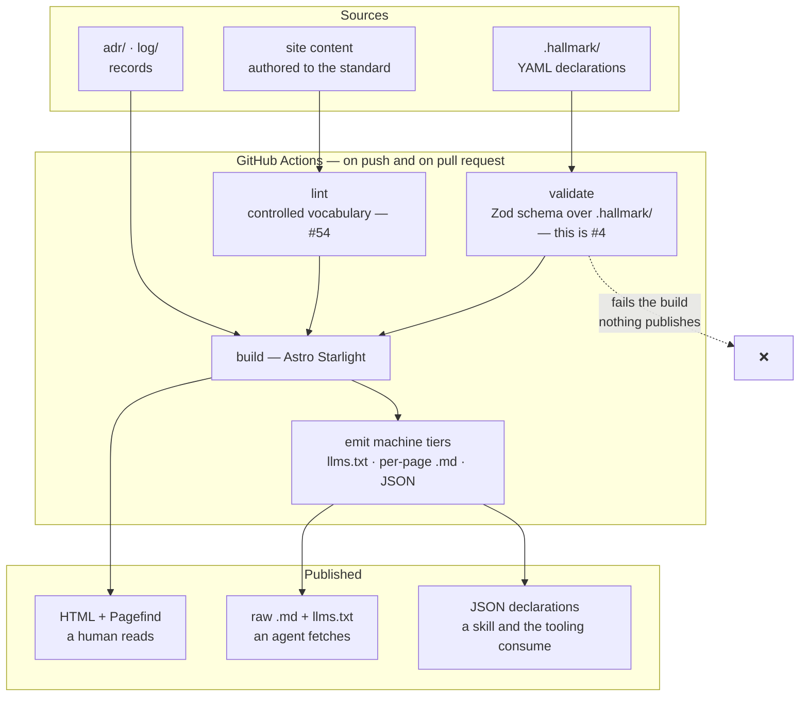
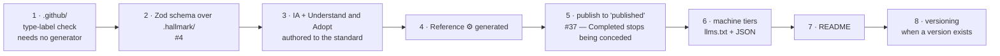

# Research — a docs site for Hallmark

| | |
|---|---|
| **Date** | 2026-08-17 |
| **Status** | Research. **No decision is taken here** |
| **Revision** | 2 — the greenfield refocus. §0 records what changed and why |
| **Branch** | `claude/agent-docs-site-research-b97dit`, from `dogfood` |
| **Relates to** | [#37](https://github.com/Kieranties/hallmark/issues/37) (build pipeline), [#38](https://github.com/Kieranties/hallmark/issues/38) (practice out of Obsidian), [#4](https://github.com/Kieranties/hallmark/issues/4) (schema), [#30](https://github.com/Kieranties/hallmark/issues/30), [#15](https://github.com/Kieranties/hallmark/issues/15), [#32](https://github.com/Kieranties/hallmark/issues/32) |

> **On placement.** This file sits at `research/` because it uses foreign vocabulary — *plugin*,
> *build*, *branch* — which the boundary rule in
> [ADR 0001](../adr/0001-the-door-declares-how-it-carries-the-practice.md) confines out of
> `.hallmark/`. That placement is undeclared and free to reverse, and it repeats the gap
> [#52](https://github.com/Kieranties/hallmark/issues/52) already names.

---

## 0 · What changed in revision 2

**Revision 1 was built on a constraint that has been withdrawn.** It treated `practice/` as
verbatim Obsidian copies that the build must leave byte-identical, and made that the sharpest
discriminator in the comparison. The Decider has since stated that Obsidian is only where
content was sourced, and has no bearing on the site.

Three consequences, and the third is the largest:

| | Revision 1 | Revision 2 |
|---|---|---|
| **The Obsidian constraint** | The decisive discriminator. Eliminated Antora outright | **Void.** Antora is now eliminated on R4 alone, which is weaker but still sufficient |
| **`starlight-obsidian`** | The second of four reasons to pick Starlight | **Void.** The recommendation now rests on three reasons, not four |
| **The corpus** | Content to be published, transformed at build time | **Source material to be mined.** Phase one authors the site new. Migration is not the task |

**The recommendation survives the change**, on a narrower argument. §6 re-derives it rather
than asserting that it still holds.

---

## 1 · The requirements

Seven were stated. Two are derived from the material, and are marked as such because nobody
asked for them.

| # | Requirement | Reading used here |
|---|---|---|
| **R1** | A README | The repository root has none. `practice/README.md` is a provenance note for one directory |
| **R2** | A build pipeline | Something runs on a commit. #37: *"`main` has no `.github/` directory"* |
| **R3** | Published to a docs branch or hosting | The artifact leaves the repository and is retrievable |
| **R4** | Readable by a human, and by an agent as markdown | Three tiers — see §3 |
| **R5** | Mermaid diagrams | 13 exist in the source material already |
| **R6** | Search | Over the whole corpus |
| **R7** | Versioning of content | More than one version of the practice readable at once |
| **R8** | *(derived)* Generated from the declarations, not restated | `.hallmark/` is structured data. A hand-written page about the door drifts from the door |
| **R9** | *(derived)* Authored, not migrated | Phase one writes the site new. §4 explains why this is a requirement and not a preference |

---

## 2 · The source material

Measured on `dogfood`. **This is what the site is written *from*, not what it publishes.**

| Body | Files | Size | What it is now |
|---|---|---|---|
| `practice/` | 10 | **~600 KB** | The practice as discovered. Working documents |
| `.claude/skills/` | 12 | ~57 KB | Two skills — the executable form of the practice |
| `.hallmark/` | 12 | ~8 KB | Declarations. **The one body that is already structured** |
| `log/` | 2 | ~43 KB | Session records, including the 26 findings of #30 |
| `adr/` | 1 | ~5 KB | ADR 0001 |

**The corpus is skewed onto two files.** `Hallmark - Decisions.md` is 426 KB across 186
decision rows. `Hallmark - Glossary.md` is 85 KB over 864 lines and carries 102 of the
corpus's 139 internal links.

**Those two are not the same kind of thing, and the site should not treat them alike:**

- **The Glossary is the controlled vocabulary**, which the practice names as one of its three guards. It transfers to the site nearly intact, because being exhaustive and cross-linked *is* its job. It is the one document that survives the rewrite mostly as-is.
- **Decisions is a working record.** 186 rows of *why*, with supersession markers. It serves the `evaluator` persona as evidence, and it serves nobody as documentation. Publishing it unedited under a **records** section is right; rewriting it into pages is a large cost with no reader.

---

## 3 · Agent-readability has three tiers

**#38 is explicit that relocation is not the win:**

> Copying the documents into `practice/` would fix reachability and nothing else. **The skills
> would still read prose and re-derive the same criteria.**

So R4 is not satisfied by markdown alone. It has three tiers, and the third is what #38 is
actually asking for:

| Tier | Serves | Mechanism |
|---|---|---|
| **1 · HTML** | A human reading | The rendered site |
| **2 · Raw markdown** | A general agent fetching a page | `<path>.md` per page, plus `/llms.txt` and `/llms-full.txt` |
| **3 · Structured data** | **A Hallmark skill establishing what `Specified` requires** | The declarations and state criteria as JSON at stable URLs — **consumed, not interpreted** |

**Tier 3 is not a feature any of these products ship.** It is a build output, and it is
largely generator-independent. This matters twice over now that tooling is also being built:
the tools that enact the process should read tier 3, not scrape tier 1.

**Do not choose the generator on tier 3, and do not let the generator choice delay it.**

---

## 4 · Why the rewrite is a requirement, not a preference

The existing documents were written while the practice was being discovered. That gives them a
property that is correct for a working document and disqualifying for a published one:
**almost every one of them is four documents at once.**

The Delivery model explains the reasoning, specifies the normative model, instructs the reader
and records decisions — in the same section, in the same voice. A reader following an
instruction hits a paragraph of rationale. A reader evaluating the claims hits a step.

**The four page types and the four declared personas line up**, which is what makes the split
tractable rather than a matter of taste:

| Persona | Page type | Shape |
|---|---|---|
| **adopting-team** | **Tutorial** / how-to | Numbered steps, each with a verifiable outcome |
| **practice-actor** | **How-to** / reference | Entry condition, act, what it leaves behind |
| **application-implementer** | **Reference** | Exhaustive, structural, normative words used precisely |
| **evaluator** | **Explanation** and generated record | Prose that argues; tables that evidence |

**This is the substance of phase one.** Splitting by reader is the work. Choosing a generator
is comparatively trivial, and doing it first would be optimising the easy half.

**The standard that governs it now exists** at [`standards/writing.md`](../standards/writing.md),
with an agent that applies it at `.claude/agents/technical-writer.md`. §8 covers both.

---

## 5 · The candidates and the matrix

Seven, against the five asked for — chosen to cover the distinct architectural bets rather
than to list every product.

✅ native · 🟡 plugin or standard workaround · ⚠️ weak, immature or manual · ❌ absent

| | **A** Starlight | **B** Docusaurus | **C** MkDocs/Zensical | **D** VitePress | **E** Antora | **F** Quartz | **G** Fumadocs |
|---|---|---|---|---|---|---|---|
| **R4** Raw md + llms.txt | 🟡 `starlight-llms-txt` — llms.txt, `-full`, `-small` | 🟡 several plugins; raw `/{path}.md` | ⚠️ `mkdocs-llmstxt`; **Zensical: open request only** ([#252](https://github.com/zensical/zensical/issues/252)) | 🟡 community plugin | ❌ **AsciiDoc is the source** | ⚠️ nothing standard | 🟡 good primitives, manual routes |
| **R5** Mermaid | ✅ | ✅ official theme | ✅ native (Material) | 🟡 | 🟡 Kroki, **renders to image** | ✅ native | ✅ |
| **R6** Search | ✅ **Pagefind**, no service | 🟡 plugin, or Algolia | ✅ built in | ✅ built in | 🟡 Lunr extension | ✅ built in | ✅ Orama |
| **R7** Versioning | ⚠️ `starlight-versions`, **early development** | ✅ **best in class** | 🟡 `mike`; **Zensical: bottom of roadmap** | ❌ | ✅ **best in class**, multi-repo | ❌ | ⚠️ community only |
| **R8** Pages from YAML | ✅ **content layer `file()` + Zod** | 🟡 custom plugin (JS) | 🟡 `gen-files` + `macros` | 🟡 dynamic routes | ❌ | ❌ | 🟡 |
| **R9** Authored fresh | ✅ MDX + components | ✅ MDX + components | 🟡 markdown + Python ext | ✅ | ⚠️ AsciiDoc authoring | ⚠️ notes-shaped | ✅ |
| **Handles a 426 KB page** | ✅ | 🟡 React hydration cost | ✅ | ✅ | ✅ | ✅ | 🟡 |
| **Longevity** | ✅ active | ✅ active | 🔴 **EOL 2026-11-05** | ✅ active | ✅ slow, stable | 🟡 small team | 🟡 fast-moving |

### The eliminations

**C — Material for MkDocs reaches end of life on 5 November 2026**, eleven weeks out. Zensical
is a real successor by the same team, but sits at **0.0.55**, with the API still moving, the
module system not yet open to third parties, **versioning at the bottom of its roadmap**, and
**llms.txt an open feature request**. Two requirements unmet on a pre-1.0 tool. Re-test in
2027; do not start here.

**E — Antora** has the best versioning of the seven and is the only candidate built for many
repositories at once, which would suit a practice designed to be adopted. It loses on **R4**:
AsciiDoc is the source format, so the markdown an agent wants is not the artifact. **Record it
as the fallback if Hallmark ever publishes many adopting repositories' practice together.**

**D, F, G** — VitePress and Quartz fail R7 outright, and Quartz is shaped for a note garden
rather than a structured docs product. Fumadocs is capable but drags a Next.js application in
to serve static prose and leaves R7 to the community.

---

## 6 · Recommendation, re-derived

### Build on **Astro Starlight**

Revision 1 gave four reasons and one of them was the Obsidian plugin. **That reason is now
void.** Three remain, and the first carries most of the weight.

**1 · It answers R8 and #4 with one mechanism.** Astro's content layer reads YAML through a
`file()` loader and validates it with a **Zod schema**. `.hallmark/personas/*.yml` becomes
typed, checked content that generates pages. **That schema is the same artifact
[#4](https://github.com/Kieranties/hallmark/issues/4) needs** — *"No schema or verification
tooling exists, so nothing can reach `Specified`"* — and #4 blocks the whole track. No other
candidate collapses those two pieces of work into one.

**This reason got stronger, not weaker.** Tooling is now also being built to enact the
process. That tooling and the site want the same thing: one validated schema over `.hallmark/`
with a machine-readable projection. Building it as the site's content layer means it is
exercised on every commit rather than kept in step by hand.

**2 · Pagefind ships as the default search.** R6 with no service, no key, no cost, nothing
that can lapse. For a repository whose argument is that claims must be checkable without
asking anyone, a search index that is a build output is the consistent choice.

**3 · R4 tiers 1 and 2 are one plugin.** `starlight-llms-txt` emits `llms.txt`,
`llms-full.txt` and an `llms-small.txt` for smaller context windows.

### The cost, stated plainly

**R7 is the weak point.** `starlight-versions` describes itself as *"still in early
development. Expect frequent updates and changes."* It is the one requirement where this is
not the strongest option.

**Why it is still the right call:** Hallmark has no released versions. The milestone carrier
is declared, but [#15](https://github.com/Kieranties/hallmark/issues/15) records that nothing
carries the version an item landed in, so **there is nothing to version the docs against yet**.
R7 is real and not yet exercisable.

**The fallback, if the plugin disappoints:** build each tagged version into its own
subdirectory from a git tag and publish a switcher. That is what `mike` does for MkDocs. It is
pipeline work, not generator work, so it stays available whatever is chosen.

### If versioning must work on day one, choose **Docusaurus**

The honest runner-up. Versioning is mature and first-class, and the plugin ecosystem for raw
markdown and llms.txt is the largest here. The price: **R8 becomes a custom JS plugin that
buys nothing toward #4**, and the 426 KB Decisions page is the worst fit for React hydration
of any option.

---

## 7 · The information architecture

**This is the part that answers "communicate what the process is and how to apply it."**
Six sections, each with one page type and one primary reader.

```mermaid
flowchart TB
    L["Start here<br/>what Hallmark is, in one screen"]

    L --> U["Understand<br/>explanation"]
    L --> AD["Adopt<br/>tutorial"]
    L --> AP["Apply<br/>how-to"]
    L --> R["Reference<br/>normative"]
    L --> RE["Records<br/>evidence"]

    U --> U1["Why this exists — the failure inventory"]
    U --> U2["The four principles"]
    U --> U3["Personas, disciplines, actors, roles"]
    U --> U4["The track, and what each state achieves"]
    U --> U5["Concessions — recording compromise"]

    AD --> D1["Enable a repository"]
    AD --> D2["Declare your door"]
    AD --> D3["Declare personas, disciplines, actors"]
    AD --> D4["Check you are enabled"]

    AP --> P1["Capture"]
    AP --> P2["Work an item — per state"]
    AP --> P3["Verify an item — per state"]
    AP --> P4["Hold a role"]

    R --> R1["Glossary — the controlled vocabulary"]
    R --> R2["Declaration schema ⚙ generated"]
    R --> R3["Door carriers ⚙ generated"]
    R --> R4["States, types, markers ⚙ generated"]

    RE --> E1["ADRs"]
    RE --> E2["Concession register ⚙ generated"]
    RE --> E3["Decisions — working record"]
    RE --> E4["Status: built vs designed"]
```

| Section | Reader | Type | Written from | Notes |
|---|---|---|---|---|
| **Start here** | all | landing | new | One screen. Routes to the four paths and does nothing else |
| **Understand** | evaluator, and anyone new | explanation | Principles, Delivery model, Failure inventory | The largest rewrite. Argues; never instructs |
| **Adopt** | adopting-team | tutorial | Enable a repository | Numbered. **Every step has a checkable outcome** — the persona's declared need is *"an answer to 'are we enabled?' that is checked rather than assumed"* |
| **Apply** | practice-actor | how-to | Working an item, the two skills | Per state. Entry condition, act, what it leaves behind |
| **Reference** | application-implementer | reference | Glossary, `.hallmark/` | **⚙ Mostly generated.** This is where R8 pays |
| **Records** | evaluator | evidence | ADRs, Decisions, concessions | Published as records, banner-marked as working documents. Not rewritten |

**Two rules the IA depends on:**

**⚙ marks a generated page.** Anything derived from `.hallmark/` is generated, never authored.
A hand-written page about the door drifts from the door, and undetected drift is the condition
ADR 0001 exists to prevent.

**"Status: built vs designed" is a page, not a disclaimer.** The practice is largely *designed*
and partly *built*, and the `evaluator` persona is served by seeing which is which. Generating
that page from the open items and the concession register makes it true by construction rather
than by upkeep.

---

## 8 · The writing discipline

Landed on this branch, because a consistent method has to exist before six sections get
written by different sessions.

| Artifact | What it is |
|---|---|
| **`standards/writing.md`** | The standard. Reader-before-writing, the three registers, the controlled vocabulary, sentence rules, and a seven-pass check that is driven rather than asserted |
| **`.claude/agents/technical-writer.md`** | The agent that applies it, holding the **Worker** role |

**Two decisions inside it are worth surfacing, because they are contestable.**

**The agent acts for the `designer` discipline, and no new discipline is declared.** The
declared object of `designer` is *"the wording, ordering and naming of every step, skill,
declaration and message somebody acts on … whether the thing reads the way it works"*, which
covers documentation exactly. Declaring a sixth discipline would run into two things already
on the record:

- **[#32](https://github.com/Kieranties/hallmark/issues/32)** states the question is open, and names this precise case: *"If the list is closed, … inventing `practice-author` or `documentation` is a breach of the controlled vocabulary."* Declaring one answers #32 by fiat, which is [#29](https://github.com/Kieranties/hallmark/issues/29) — the application deciding the practice.
- **D153 already refused a parallel proposal.** A `Delivery Manager` discipline was rejected because `Delivery` already existed and *Manager* is a business title, where a discipline is a type of party. **"Technical writer" is a job title by the same test.**

**This is the Decider's call, not the research's.** If the sixth discipline is wanted, it is a
ten-line declaration plus one line in the agent — and it should carry an ADR, because #32 gets
answered either way.

**The agent is a Worker and never a Verifier of its own prose.** `worker ≠ verifier` binds, and
[#35](https://github.com/Kieranties/hallmark/issues/35) records that a subagent shares a
session and so is not independent. Verification of published prose is a separate act in a
separate session.

---

## 9 · The pipeline

**Validate gates the build**, which is what turns #4's schema from a document into a check.

### What else the pipeline carries

| Check | Closes |
|---|---|
| An issue carries **exactly one** `type-` label | **Concession 6.1**, which #37 records *"cannot expire"* without a build |
| Declarations validate against the schema | [#4](https://github.com/Kieranties/hallmark/issues/4) |
| Controlled-vocabulary lint, scoped per ADR 0001 to everything under `.hallmark/` except `door.carries` | [#54](https://github.com/Kieranties/hallmark/issues/54) |

---

## 10 · Publishing (R3)

| Route | Gives | Against |
|---|---|---|
| **Pages from an Actions artifact** | The current default. No branch, no commit noise | Opaque, not git-addressable. Only the newest build exists |
| **A `published` branch** | Every publish is **a commit with history**. Any past state retrievable by SHA | Build output in git; the branch grows |

**The branch, and #37 says why.** `Completed` has been conceded on every item because *"the
artifact left the repository and is retrievable"* has never been true. A branch makes that
checkable — a Verifier resolves a SHA. #37 also records that a **`published` branch is already
named in the branch model** and does not exist, so this builds what is already declared.

---

## 11 · Versioning (R7)

**The docs question is downstream of an open practice gap.** `repository.yml` declares
`landed-version` as **`uncarried: true`**, with the reason recorded: the milestone carries the
version an item was *committed for*, which is a different fact.

1. **Site versions map to git tags.** Works now, needs nothing from the door.
2. **A switcher** publishes `/` as newest and `/vN/` per tag.
3. **Release notes stay manual** until [#15](https://github.com/Kieranties/hallmark/issues/15) / [#71](https://github.com/Kieranties/hallmark/issues/71) give the door a landed-version carrier.

**Do not let the site invent a second version concept.** Site-versions-on-tags and
door-commits-on-milestones must be reconciled by declaration, and that is an ADR when it
happens.

---

## 12 · The README (R1)

The repository root has none. What it carries, and nothing more:

| Section | Why |
|---|---|
| What Hallmark is, in a paragraph | The `evaluator` persona may read this and nothing else |
| Who it is for — the four personas, **linked not restated** | They are declared in `.hallmark/personas/` |
| How to raise something — the door, and `/capture` | The door is the entry |
| Where the practice is — the site, once it exists | |
| The status, honestly — pre-1.0, dogfooding | Overclaiming here is the exact failure the `evaluator` persona exists to catch |

**Write it once the site exists**, so its links resolve.

---

## 13 · Sequencing

**Step 1 does not wait on anything.** A repository with no CI is the finding underneath #37,
and the type-label check alone expires a live concession.

**Steps 2, 4 and 6 are what pay #38 back**, and they are the steps the new tooling will consume.
**If effort is constrained, do those and let the prose lag.**

---

## 14 · What this does not settle

- **Whether `log/` and the 26 findings of [#30](https://github.com/Kieranties/hallmark/issues/30) are published.** They serve the `evaluator` persona and expose a lot of in-progress reasoning. A decision, not a build setting.
- **Whether `.claude/skills/` is published as documentation.** The skills are the executable form of the practice, and a reader comparing them against `practice/` finds the drift #38 describes.
- **What happens to `practice/` once the site exists.** Two sources for one practice is the condition #38 was raised about. The site does not fix it by existing.
- **Whether a sixth discipline is declared** — §8. It answers #32 either way.
- **The truncated requirement.** The first request ended mid-sentence at *"They"*. Anything after that is uncovered.

---

## Sources

- [Material for MkDocs — End of life on November 5, 2026 (#8523)](https://github.com/squidfunk/mkdocs-material/issues/8523)
- [Zensical](https://github.com/zensical/zensical) · [llms.txt request (#252)](https://github.com/zensical/zensical/issues/252) · [squidfunk/mike fork](https://github.com/squidfunk/mike)
- [Starlight plugins](https://starlight.astro.build/resources/plugins/) · [starlight-versions](https://github.com/HiDeoo/starlight-versions) · [starlight-llms-txt](https://github.com/delucis/starlight-llms-txt)
- [Astro content collections](https://docs.astro.build/en/guides/content-collections/) · [content loader reference](https://docs.astro.build/en/reference/content-loader-reference/)
- [Docusaurus 3.9](https://docusaurus.io/blog/releases/3.9) · [docusaurus-plugin-llms](https://github.com/rachfop/docusaurus-plugin-llms)
- [Antora](https://antora.org/) · [Asciidoctor Kroki](https://docs.asciidoctor.org/kroki-extension/latest/) · [Quartz](https://quartz.jzhao.xyz/) · [Fumadocs](https://www.fumadocs.dev/docs)
