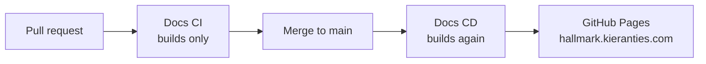

# Documentation

Nothing of the practice is published here yet. This page exists to prove the site builds and
deploys end to end; it will be replaced when the rewrite lands.

## How this site is published

A pull request builds the site but never publishes it. A merge to `main` rebuilds from `main`
rather than reusing the pull request's output — the pull request was built from a test merge that
may never have existed on `main`.

## Working on the site

The site runs entirely inside the repository's dev container; see the
[README](https://github.com/Kieranties/hallmark#developing) for the three steps.

| Command | Does |
| --- | --- |
| `npm run start --prefix website` | Dev server with live reload |
| `npm run build --prefix website` | Production build |
| `npm run serve --prefix website` | Serve the production build |
