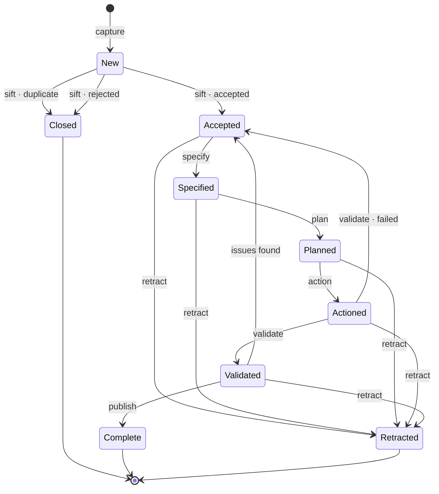

# Hallmark

**Hallmark is a delivery practice** — it defines a *principled* process through which work of
any size is delivered, *standards* are met, and what is claimed of the result is *proven*.

## The four principles

Four principles govern the practice. Each is a test that can be failed.

  <PrincipleCard index={1} name="Provable" test="If something is claimed, there must be evidence to prove it." />
  <PrincipleCard index={2} name="Derived" test="If something can be determined from the record, it must not be decided." />
  <PrincipleCard index={3} name="Traceable" test="If something is claimed, decided or moved, there must be a path to what produced it." />
  <PrincipleCard index={4} name="Invariant" test="Whatever the size of the work, or the kind of actor, the same process applies." />

## The track

Work advances by acts, and every act leaves something behind. Between one act and the next,
the work rests at a state — and every state after the first is the act that produced it, in
the past tense.

## Ways in

| Section | Covers |
| --- | --- |
| **[The practice](./practice/overview.md)** | What the practice is, the four principles, and how a practice differs from an application of it |
| **[The parties](./parties/index.md)** | Who acts — personas and disciplines, the actors they supply, the four roles, and where accountability lands |
| **[Work](./work/types.md)** | What travels: the five types, the standards work answers to, and what a commitment is |
| **[The process](./process/index.md)** | The seven acts, the states between them, and what each act requires |
| **[Applying it](./apply/declaring-an-application.md)** | What a system must declare to run the practice for real |
| **[Terminology](./terminology.mdx)** | Every word the practice reserves, and the page that owns it |

**If you are reading this to work an item**, [the process](./process/index.md) is the page to
keep open. **If you are an agent fetching a definition**,
[terminology](./terminology.mdx) is the index, and every entry names the page that owns the term.
