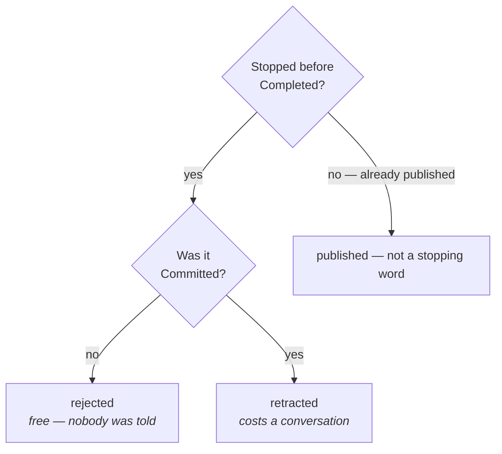

# Stopping

## What it is \{#definition}

**Stopping is an item ending before [`Completed`](./completed.md), and the word for it is
derived from state and [commitment](../items/commitment.md) read together.**

## Why it exists \{#why}

**The cost of stopping is a function of how far the thing travelled**, and the words
exist to say which cost is being paid. *Nobody was told* and *we told a client we would
and now we will not* are different conversations, and one word covering both hides the
expensive one inside the free one.

**Choosing the word would make it a presentation decision.** Under pressure, everything
becomes the cheapest available word, and the count of retreats from a promise goes to
zero without a single promise being kept. Deriving it removes the choice: the two axes
already record what happened.

**Stopping is not failure, and free stopping is the common case.** Most of what is raised
should not be built. A route that makes stopping look like a defeat produces work that
continues because stopping it would need explaining.

## Rules \{#rules}

**You do not choose the word. It is derived.**

| It stopped | And it was | So it is | Which costs |
| --- | --- | --- | --- |
| Before or after [`Accepted`](./accepted.md) | `Uncommitted` | **Rejected** | Nothing. Nobody was told |
| After `Accepted` | `Committed` | **Retracted** | A conversation — *we said we would, and we will not* |

**`Rejected` requires a recorded reason.** That reason is what makes duplicate detection
work at the next sift — *this was rejected before, because of that; has it changed?*

**`Retracted` is a recorded retreat.** It is attributable, it is recorded as an artifact,
and if the promise was ever told to a client the retreat must be too. You do not withdraw
an assertion; you retract it.

**`Duplicate` is orthogonal to both.** It means *this is the same as that*, it is
reachable at any point regardless of commitment, and it links to the original and closes.

**`Rejected` is deliberately not a recorded retreat.** Nothing was ever asserted outside,
so there is nothing to retreat from.

**An item may stop at any point once it exists.**

## In detail \{#detail}

### `Withdrawn` is not a stopping word

It names a claim being removed after it existed and was provable — which is a different
act, with a different cost, on something that already reached `Completed`. Stopping is
about an item that never got there. The two were separated because one costs trust and
the other costs a conversation, and collapsing them makes the expensive one invisible.
Removal belongs with *Claims and evidence*, which is not written yet.

### Stopping is derived, not computed for you

Nothing automatically closes an item. Somebody decides the work will not be done, and the
practice supplies the word rather than asking for one. What is removed is the choice of
word, not the decision to stop.

### Re-raising something that was rejected

A rejected item is not reopened. Where the reason it was rejected has stopped being true,
that is a new item — and the recorded reason on the old one is what lets the sift see the
difference between *this again* and *this, now that the thing that blocked it has
changed*.
