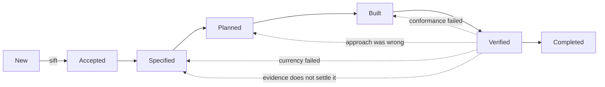

# The track

## What it is \{#definition}

**The track is the ordered set of states an item achieves, from [`New`](./new.md) to
[`Completed`](./completed.md).**

## Why it exists \{#why}

**States are achievements, not queues you wait in.** An item is not *in* `Specified`
waiting for somebody; it *has achieved* `Specified`, because the thing `Specified`
requires is true of it. That difference decides what the field can be used for: an
achievement is checkable against the item, and a queue position is only checkable against
whoever last moved it.

**One field cannot hold both where something is and how strongly it was promised.** The
two move at different times and for different reasons, which is why
[commitment](../items/commitment.md) is a second axis rather than more values on this
one.

**The track has to allow going backwards, or it lies.** Work that does not match what
was asked, or that matches a target which has since moved, has to return to where the
problem is — and a route that only runs forwards makes the last state the place every
problem is discovered.

## Rules \{#rules}

### What a state is

**A state is achieved when its criterion is met.** Nothing else advances it: not a
meeting, not a decision to call it done, not the passage of time.

**An item's position is the highest state it has achieved.**

**The state says where an item is, and therefore what should be done next. It never says
when, or by whom.** Finding work is a separate signal — see
[markers and claiming](../items/markers-and-claiming.md).

### The seven

[`New`](./new.md) · [`Accepted`](./accepted.md) · [`Specified`](./specified.md) ·
[`Planned`](./planned.md) · [`Built`](./built.md) · [`Verified`](./verified.md) ·
[`Completed`](./completed.md). What each one requires is on its own page.

**Two [types](../items/types.md) do not travel the track at all** — a question and a
service request. Neither is promised and neither is built.

### Not a waterfall

**Work returns.** `Verified` sends work back to `Built`, or to `Planned` where the
approach was wrong, or to `Specified` where the target moved or the evidence does not
settle the question.

**Returning is not failure of the track.** It is the track finding the thing it exists
to find, at the first point anybody could have found it.

### Leaving the track

**An item may stop at any point once it exists**, and the word for stopping is derived
rather than chosen — see [stopping](./stopping.md).

**The track ends at `Completed`.** Which consumers actually hold the work is a separate
axis again, and belongs with *Claims and evidence*.

## In detail \{#detail}

### The same track for a typo and a programme

A one-line change and a multi-year body of work travel the identical seven states. What
scales is not the route but the apparatus, and that is derived from
[touch](./touch.md) rather than from anybody's judgement of importance. A change that
touches nothing carries almost nothing — by rule, not by permission.

That is what makes the track survivable at both ends. A route with optional stages for
small work becomes a route with optional stages, and the stages that are optional are the
ones that get skipped under pressure.

### Why the arrows back point where they do

Each return goes to the state that owns the problem, not to the start.

| Failed on | Returns to | Because |
| --- | --- | --- |
| **Conformance** | `Built`, or `Planned` if the approach was wrong | The target was right and the work missed it |
| **Currency** | `Specified` | The target moved |
| **The evidence does not settle it** | `Specified` if the criteria do not cover it · `Built` if they do and were not driven | Nothing is proving what is being claimed |

### One track, one item

An [initiative](../items/types.md) has no work of its own, so it has no position of its
own — its position is whatever its children add up to. Nothing else aggregates: each
item's position is a fact about that item.
