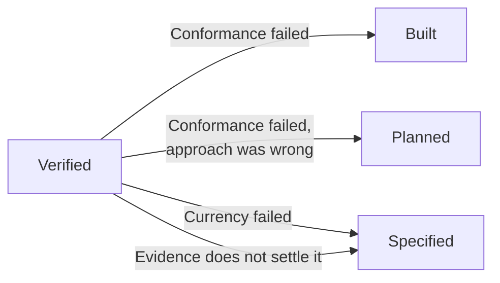

# Verified

## What it is {#definition}

**An item is `Verified` when an actor who did not do the work confirms both that the work
matches what was asked, and that what was asked is still the right thing to have built.**

## Why it exists {#why}

**Nobody can review their own work.** Whoever sat through the doing knows which parts were
rushed and which arguments were already had, and cannot un-know it. Left to check their own
work, they check it against what they remember wanting — which is not what was asked, and
drifted towards what they built while they were building it.

**The target moves while the work is in flight.** A change lands elsewhere, a client
decision reverses, another item ships something that makes this redundant. The work can be
a faithful answer to a question nobody is asking any more.

Those are two different failures and they need two different checks. **Conformance** is the
one everybody runs. **Currency** is the one almost nobody runs, and it is the one that
catches the expensive failures — because work that conforms perfectly to a stale target
passes every other gate in the track.

## Rules {#rules}

### The verifier

**The Verifier is not the Worker.** This is never conceded. There is no item, no deadline
and no shortage of actors that permits the same actor to hold both roles on one item.

**The Verifier is given everything except the session.**

| Must have | Must not have |
| --- | --- |
| The item · the acceptance criteria · the spec · the plan and what it touches · the change itself · the standards · any decision records · what else changed while the work was in flight | The session in which the work was done |

One thing is withheld, for one reason: whoever sat through the work cannot un-know what was
rushed. Everything else is shared deliberately — **independence without shared references
produces noise, and shared references without independence produce a rubber stamp.**

### The two checks

Both must hold. An item that passes one is not verified.

| Check | Asks |
| --- | --- |
| **Conformance** | Did the work match what was asked, to standard? |
| **Currency** | Is what was asked still right, given what changed while the work was in flight? |

### The two outcomes

**A Verifier has exactly two outcomes: it verifies, or it sends the work back.** There is no
third.

**A Verifier does not escalate.** If the evidence does not settle the question, the evidence
is insufficient — and producing sufficient evidence is the Worker's job. That is a
verification that fails, not a reason to summon anybody. *If nothing proves the claim, the
claim is not proved.*

### Where it goes back to

| It failed on | Goes back to | Because |
| --- | --- | --- |
| **Conformance** | `Built` — or `Planned` if the approach was wrong | The target was right; the work missed it |
| **Currency** | `Specified` | The target moved |
| **The evidence does not settle it** | `Specified` if the criteria do not cover it · `Built` if they do and were not driven | Nothing is proving what is being claimed |

## In detail {#detail}

### Verification is not acceptance

They are two acts, not two degrees of the same act.

| | Is | Held by |
| --- | --- | --- |
| **Verification** | Gathering evidence against a stated standard | A Verifier |
| **Acceptance** | Judging *this is what I wanted* | A Decider |

Acceptance can be refused, or simply never given. No verification can — it is settled by
evidence against a standard that was fixed in advance.

:::note[Verification always names its object]
The change, the deployment, the feature. Those are one act pointed at different things, not
three different meanings of the word.
:::

### When you are the only actor

You cannot verify your own work, and with one actor there is nobody else. **That is recorded
once when the repository is enabled, not argued about per item.**

What still holds:

- Write the acceptance criteria **before** the work exists. That is the whole defence — you
  are checking against a target fixed in advance, not against what you remember wanting.
- Re-drive every criterion deliberately at `Built`.
- Check conformance **and** currency here, even though it is you doing it.

**A fresh agent session is the cheapest second actor there is.** Give it the item, the
criteria, the spec, the plan, the change and the standards. **Do not give it the conversation
in which the work was done** — that is the one thing a Verifier must not have, and handing it
over turns an independent check into an expensive echo.

:::warning[The honest limit of working alone]
Even with a fresh actor, it has clean context and you do not. You know which part you rushed,
and you will steer it without meaning to. This is why a second person is worth more than any
tooling.
:::

### Publishing does not reach here

Publishing is an act; `Verified` is a state. An artifact published before it is verified
leaves the item at `Built` **with a published artifact** — the publishing happened, and it
moved nothing.

The catalogue is generated from **verified** published artifacts, never from everything on a
registry.

:::warning
If publishing routinely runs ahead of verification, verification becomes a formality nobody
blocks on. **What is published-but-unverified has to be distinguishable by whoever consumes
it** — a prerelease, a separate channel, a tag.
:::
