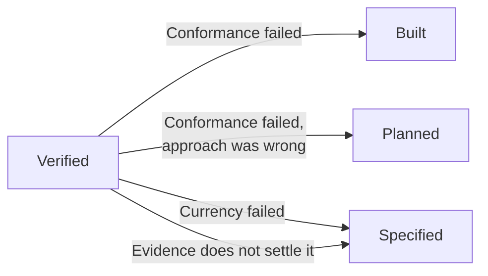

# Verified

## What it is \{#definition}

**An item is `Verified` when an actor who did not do the work confirms both that the work
matches what was asked, and that what was asked is still the right thing to have built.**

## Why it exists \{#why}

**Nobody can review their own work.** Whoever sat through the doing knows which parts were
rushed and which arguments were already had, and cannot un-know it. Left to check their
own work, they check it against what they remember wanting — which is not what was asked,
and drifted towards what they built while they were building it.

**The target moves while the work is in flight.** A change lands elsewhere, a client
decision reverses, another item ships something that makes this redundant. The work can be
a faithful answer to a question nobody is asking any more.

Those are two different failures and they need two different checks. **Conformance** is
the one everybody runs. **Currency** is the one almost nobody runs, and it is the one that
catches the expensive failures — because work that conforms perfectly to a stale target
passes every other gate in the track.

## Rules \{#rules}

### The verifier

**The Verifier is not the Worker.** This is
[never conceded](../foundations/never-conceded.md). There is no item, no deadline and no
shortage of actors that permits the same actor to hold both roles on one item.

**What the act requires is [verification](./verification.md).** Clean context, shared
references, and what a Verifier is given and what is withheld are stated there and are not
restated here.

### What must hold

**Both checks pass.** [Conformance](./verification.md#rules) — the work matches what was
asked, to standard — and [currency](./verification.md#rules) — what was asked is still
right, given what changed while the work was in flight. An item that passes one is not
verified.

**The confirmation is about *this item*.** Whether the whole set still holds together is
[`Completed`](./completed.md).

**A verification has two outcomes: it verifies, or it sends the work back.** A Verifier
does not [escalate](../parties/escalation.md).

### Where it goes back to

| It failed on | Goes back to | Because |
| --- | --- | --- |
| **Conformance** | [`Built`](./built.md) — or [`Planned`](./planned.md) if the approach was wrong | The target was right; the work missed it |
| **Currency** | [`Specified`](./specified.md) | The target moved |
| **The evidence does not settle it** | `Specified` if the criteria do not cover it · `Built` if they do and were not driven | Nothing is proving what is being claimed |

## In detail \{#detail}

### Publishing does not reach here

Publishing is an act; `Verified` is a state. An artifact published before it is verified
leaves the item at [`Built`](./built.md) **with a published artifact** — the publishing
happened, and it moved nothing.

What the system claims is generated from **verified** published artifacts, never from
everything on a registry. What that requires of the publishing side is on
[`Completed`](./completed.md).

### Verifying against a target nobody fixed

Where the acceptance criteria do not cover what is being claimed, currency and conformance
both have nothing to be settled against, and the verification fails on evidence rather
than on the work. That returns the item to [`Specified`](./specified.md) — which is the
track finding, late, that a state's criterion was never actually met.

### With one actor

The Verifier role is unheld, that is recorded once when the repository is enabled, and
what still holds is on [working alone](./working-alone.md). Both checks are still run
here, by the same person who did the work, against criteria fixed before it existed.
