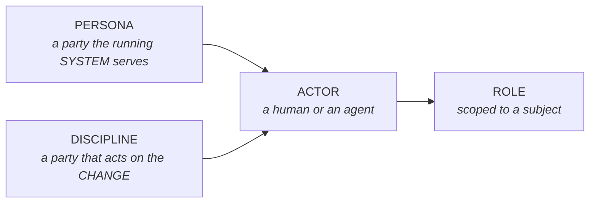
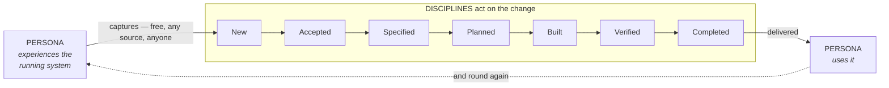

# The structure

## What it is \{#definition}

**The parties, the actors and the roles are one structure with two symmetric branches: a
[persona](./personas.md) or a [discipline](./disciplines.md) supplies an
[actor](./actors.md), and the actor holds a [role](./the-four-roles.md).**

## Why it exists \{#why}

**The two branches are distinguished by their object, not by a verb.** A persona is a
party the running *system* serves; a discipline is a party that acts on the *change*.
Any wording that sorts them by what they do fails on its own list — product and delivery
build nothing, and a client's rollout decider ends up classified as a persona sitting
inside a flow that is otherwise discipline-driven.

**Both branches are needed, and each is load-bearing for something different.** Without
the discipline branch, most of the track holds roles with no party above them. Without
the persona branch, the account of what the system does has no axis to be organised on.

**Presented as four independent concepts, the structure disappears.** Persona,
discipline, actor and role read as four topics you could learn in any order, and the
only thing that makes them cohere — that two kinds of party converge on one kind of
actor, which holds one kind of position — is exactly what gets lost.

## Rules \{#rules}

**Two branches converge on the actor.**

**A party acts as itself, or delegates to an agent, to perform a role.** There is no
third route in.

**The four roles describe any action on or with the system, not only delivery actions.**
An Operator restarting a service is a Worker. An Auditor reviewing logs is a Verifier.
Were the roles only delivery positions, the persona branch would have nothing to attach
to.

**Supplying a signal to the flow is not holding a role in it.** A persona raising a
runtime bug report does not thereby become a discipline. The test is which of the two it
did.

**A discipline may also supply a signal, mid-flow, and that changes nothing.**

## In detail \{#detail}

### Where the two branches hand over

The track is a circuit between two persona moments, with a blurred zone at each end.

**Capture is the blurred entry**, before the item exists, which is why it is free and
open to anyone. **Delivery is the blurred exit**, after the work is published and before
anyone uses it.

The blurred exit is why *published* and *in a consumer's hands* are two facts rather
than one, and it is the loop a client-raised issue travels to re-enter at
[`New`](../loop/new.md).

### One person, several parties

A party is a type, not an individual. One human may be several personas and several
disciplines at once — the developer consuming your package on Tuesday is a persona, and
the same person shaping next week's work is a discipline. Nothing about the structure
requires them to be different people, and nothing about it lets one of them stand in for
the other.
