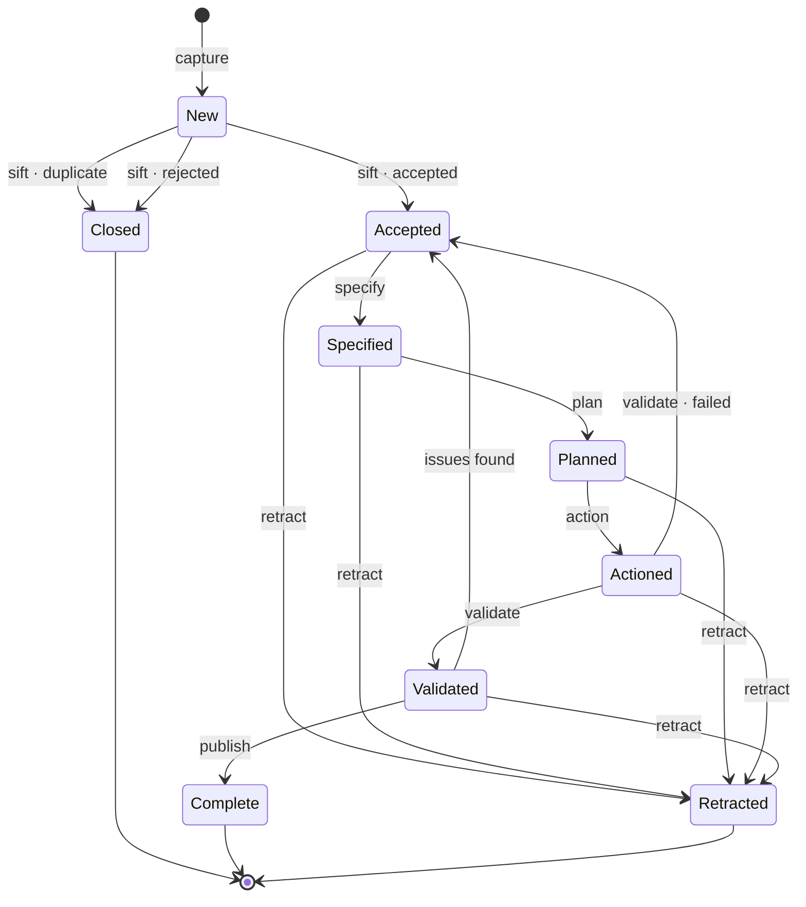

# The states

**Between one act and the next, the work rests.** A state says where an item has got to, and
it holds there until somebody picks the next act up. **Every state after the first is the act
that produced it, in the past tense.**

**A failed verification is not a state change.** The work is returned inside the act it never
left — an item whose specifications were sent back is still `Accepted`, because it is not yet
specified. The same holds at every gate.

**Two paths return to `Accepted`, and both mean the same thing: the criteria were wrong.** One
leaves `Actioned` when [validation](./validate.md) fails outright; the other leaves
`Validated` when something surfaces afterwards. Either way the work goes back to the
[specifying](./specify.md), because there is nothing wrong with the change — only with what
was asked of it.

**Each return goes to the state that owns the problem, not to the start.** That is one rule
rather than a pair of special cases, and it is what keeps a return proportionate to what was
actually found.

**Returning is not failure of the track.** It is the track finding the thing it exists to
find, at the first point anybody could have found it.

## Retraction

**Retraction is available from every state the [sift](./sift.md) has let through.** A
[Decider](../parties/roles.md) withdraws the [commitment](../work/commitment.md) and the work
stops, from `Accepted` through to `Validated`.

The two ends are excluded for opposite reasons. At `New` nothing has been agreed to, so there
is no commitment to withdraw — a request turned away there, whether as a duplicate or rejected
outright, is `Closed`, and costs nobody a conversation. At `Complete` it has already been
delivered, and there is nothing left to withdraw either.

:::important[A state is not a work queue]
The state says where an item *is*, and therefore what should happen to it next. It does not
say **when**, or **by whom** — an item can sit at `Specified` for a month without that meaning
anything is wrong.

**Finding work is a separate mechanism.** Something on the item has to call it to action; what
that something is — an assignee, a label, a column, a notification — belongs to the
[application](../practice/practice-and-application.md). Without it, people go looking for work
by scanning states, and the state field quietly becomes a priority list.
:::

**A [concession](../apply/concessions.md) may be recorded at any point.** It is a record *on*
the work of what could not be met — never a decision, never a branch. It changes nothing about
where the work goes; it changes what is known about it, and who is answerable for that.
