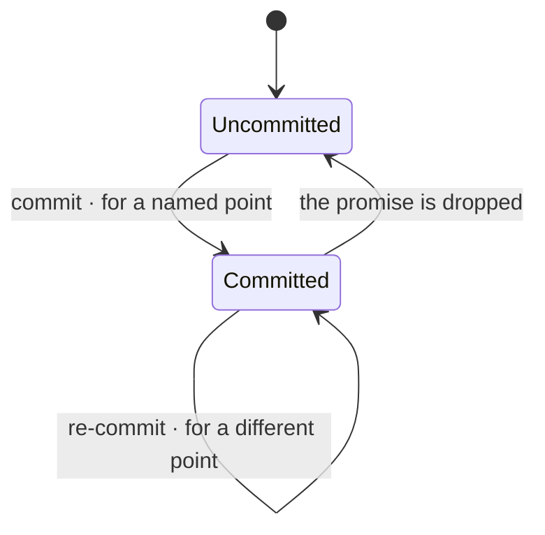

# Commitment

**A promise that the work will be delivered by a named point.** Made by a
[Decider](../parties/roles.md), who is answerable for it — no evidence can exist yet, which is
precisely why someone must be. What the point is — a release, a version, a date — is an
[application](../practice/practice-and-application.md) matter.

**Commitment is a property of the work, not a state of it.** The two move independently:
something may reach `Validated` having never been promised to anyone, and something may be
promised the day it is accepted and not started for months.

**Nothing is committed before it is accepted.** Promising work that has not been ruled valid
is promising something that may yet turn out to be a duplicate, or not worth doing at all.

**Only a Decider commits.** A commitment is spoken outside before any evidence exists, so
somebody has to be answerable for it — and that is the whole reason the role exists.

**Slippage is computed, never reported.** Promised for one point, delivered at another: the
difference is simply the two values, and it is visible without anyone having to admit
anything. Nothing has to be confessed for it to be known.

## Retraction

**Retraction is a move on the work, not on the promise.** Deciding the work should not be done
withdraws what was accepted, and the item becomes `Retracted` — the promise dies with it.
Deciding only that the point was wrong is a re-commitment, and costs a different conversation.

**What retraction costs is derived from this axis, not from the work's state.** Retracting
uncommitted work costs nothing outside — nobody was told. Retracting committed work costs a
conversation, because somebody was. The [state](../process/states.md) is identical in both
cases; the property is what makes them different.
